# 在 Red Hat Mobile Node.js 应用程序中使用 New Relic

> 原文：<https://developers.redhat.com/blog/2017/09/15/using-new-relic-red-hat-mobile-node-js-applications>

# 简介

New Relic 是一个应用程序监控平台，无论应用程序部署在什么类型的环境中，它都能为应用程序提供深入的分析和剖析:

*“借助全新的 Relic 数字智能平台，获得客户体验、应用性能和动态基础设施的端到端可见性。”* -新遗迹

你可能会问，既然 Red Hat Mobile Application Platform(RHMAP)和 OpenShift Container Platform 都可以洞察服务器端应用程序的 CPU、磁盘、内存和一般资源利用率，为什么还要使用 New Relic 的监控功能。虽然这些通用资源报告很有价值，但它们可能无法提供调试特定问题所需的详细信息。由于 New Relic 是作为一个全新的分析平台而构建的，它能够为您的应用程序的特定运行时提供独特的见解。例如，Node.js 应用程序中部署的 JavaScript 代码是使用 V8 JavaScript 引擎运行的，该引擎的生命周期会对应用程序的性能产生重大影响，这取决于您如何编写它。利用 New Relic 的 Node.js 模块提供了 V8 引擎性能的实时视图，以及它们可能如何影响您的生产应用程序的性能。通过使用这些数据，您可以优化您的应用程序代码以减少内存使用，这反过来又可以由于垃圾收集的频率降低而释放 CPU 资源。整洁！

现在我们已经了解了 New Relic 可以提供什么，我们将带您了解将新 Relic 监控添加到部署在 Red Hat 移动应用程序平台上的 Node.js 应用程序所需的步骤。在这篇博文结束时，您将拥有一个可重用的配置文件，它是基于您正在部署的 Node.js 应用程序动态生成的，并且能够在您将应用程序升级到上层环境时让 New Relic 自动检测部署。

# 先决条件

我们假设您有一个 Red Hat 移动应用程序平台实例可用于本指南。你还需要去 newrelic.com/signup[](https://newrelic.com/signup)注册一个新的遗迹账户，并输入一些细节。此时您不需要输入任何支付信息，但需要付费订阅才能解锁它们提供的所有功能，例如我们在这篇博文的部分中使用的 Node.js VM 统计数据。

# 在 RHMAP 上创建一个项目

*注意:如果您有一个包含 Node.js 云应用程序的现有项目，您可以随意跳过这一部分并使用您现有的项目。*

导航到您的 Red Hat 移动应用程序平台实例并加载项目屏幕。它应该看起来类似于下面的屏幕，你可以看到我已经有一些现有的项目。

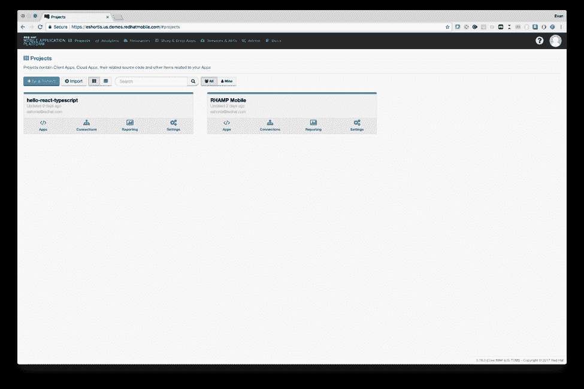

在该屏幕的左上角单击 *新建项目* ，然后在下一个屏幕上选择 *Hello World 项目* 模板，并输入项目名称和云应用程序的唯一名称，如图所示。为云应用程序输入一个唯一的名称很重要，因为我们将使用这个名称将其链接到 New Relic 仪表板。输入姓名后，向下滚动并点击 *创建* 。

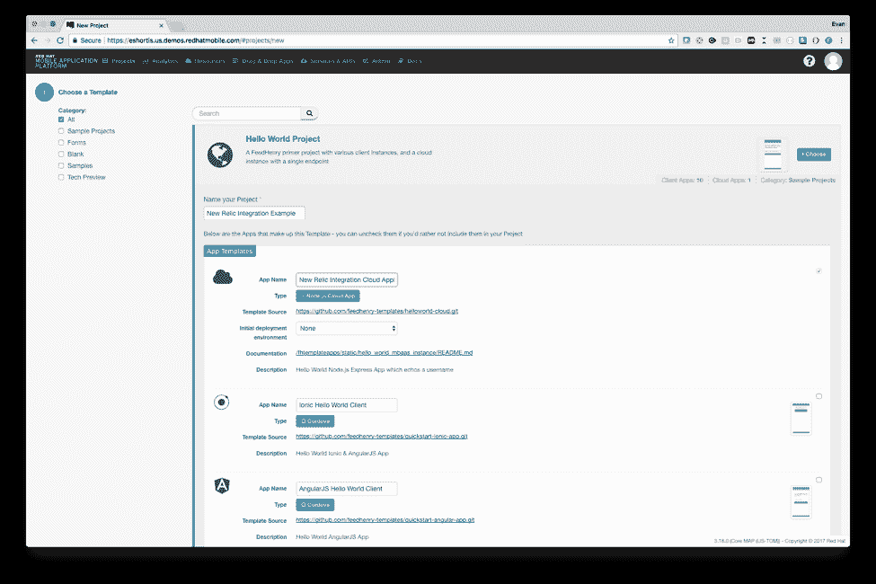

一旦项目创建过程完成，您应该会看到详细说明所采取行动的输出，下面是一个 *完成* 按钮。点击 *完成* ，你将进入如下所示的项目屏幕。

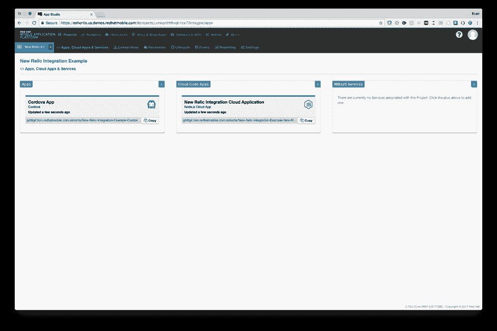

祝贺你，你已经创建了一个项目。让我们从用新的 Relic 模块更新基于 Node.js 的云应用程序开始。

# 向 Node.js 应用程序添加新遗迹

向 Node.js 云应用程序添加新的遗迹监控是多么容易，您会对此感到惊喜。让我们从使用 Red Hat 移动应用程序平台 UI 配置 Node.js 云应用程序开始。

导航至您的项目，点击您的云应用程序进行查看。在下一个屏幕中，选择左边的 *编辑器* 选项来加载我们的基于网络的编辑器。通常，我们建议使用 Git 和本地文本编辑器与您的项目源代码进行交互，但是为了简单起见，在本指南中，我们将使用这个 *编辑器* 屏幕。

## 添加依赖关系

在编辑器中选择*package . JSON*文件，并在 *依赖关系* 块中添加下面几行:

```
  "newrelic": "~2.0.1",
  "env-var": "~2.4.3"

```

我们在版本号前添加了一个波浪符号(~)来指定应用程序应该安装模块的最新补丁版本，同时考虑主版本号和次版本号。这意味着以后的部署可能会安装 2.0.2 版本的新 Relic 模块，但不会使用高于 2.0 的版本。更多关于 *package.json、* 依赖部分查看[npmjs.com 塞弗指南](https://docs.npmjs.com/getting-started/semantic-versioning) 。

在进行了指定的更改后，您的 package.json 将类似于下图所示:

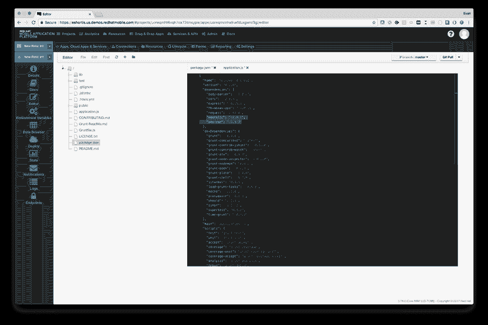

使用 *文件* 菜单选择 *保存* 就可以进行下一步了。

## 加载新遗迹模块

接下来，我们将更新*application . js*文件，以使用我们添加的新依赖项。将下面一行添加到*Application . js*文件的顶部，在所有其他 *要求* 语句之前，将新的 Relic 模块加载到您的 Node.js 云应用程序中。

```
require('newrelic');
```

下面是*application . js*一旦更新后的样子:

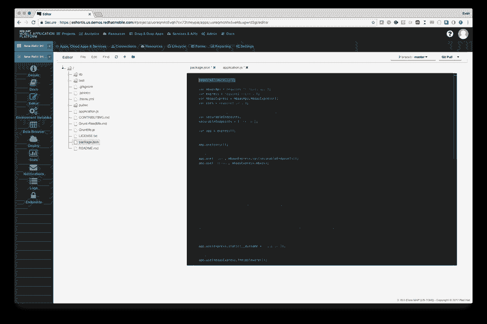

## 配置新遗迹模块

New Relic 模块通过在项目的根目录下搜索一个*New Relic . js*文件来配置自己，所以我们需要创建这个文件。

从 *文件* 菜单中选择 *新文件* ，然后在出现的对话框中输入名称*New relic . js*。在已创建的新文件中粘贴以下配置并保存:

```
'use strict'

const get = require('env-var');
let name = get('FH_TITLE').asString();
let env = get('FH_ENV').asString();

if (!env) {
 // environment is not defined - we’re running on developer machine
 name = 'Local Development Cloud'
} else {
 // produces 'YourNodeAppName-dev' or similar
 name = `${name}-(${env})`

}

exports.config = {
 app_name: [name],

 // This will be loaded from an environment variable since we 
 // don’t want to check it into our code in plaintext
 licence_key: get('NR_LICENCE_KEY').required().asString(),

 logging: {
 // output to stdout instead of a logfile - rhamp monitors stdout
 filepath: 'stdout',
 // changing this is easier when it’s an environment variable
 // defaults to the info level if not defined in the environment
 level: get('NR_LOG_LEVEL', 'info').asString()
 }
}
```

该文件读取 Red Hat Mobile 应用程序平台定义的环境变量，以定制您的应用程序的运行时。当您将应用程序推向生产时，环境变量通常会发生变化，例如，NR_LOG_LEVEL 在开发中可能是“trace ”,但在生产中可能是“info”。

下面是我们将使用的变量的快速解释:

1.  FH_TITLE -您的应用程序的名称。Red Hat 移动应用程序平台在部署应用程序时注入了这一点。
2.  FH _ ENV——应用程序运行的环境。通常包含的值有*dev**test、* 或*prod*。红帽移动应用平台也注入这一点。
3.  NR _ license _ KEY-我们将在接下来的步骤中添加它。这将是你的新遗物许可证钥匙。
4.  NR_LOG_LEVEL -新遗迹模块将使用的日志级别。

## 定义环境变量

上面的 NR_LICENCE_KEY 和 NR_LOG_LEVEL 变量是我们需要添加到应用程序中的自定义值。在 Studio 中的 *编辑器* 链接的正下方，您可以单击 *环境变量* 链接，应该会显示您的应用程序已经定义的变量列表。现在，列表应该是空的，因为我们还没有部署我们的应用程序。

点击 *添加变量* 按钮，在弹出的对话框中输入*NR _ LOG _ LEVEL*为变量名，输入*info*为变量值，然后点击 *添加* 按钮。

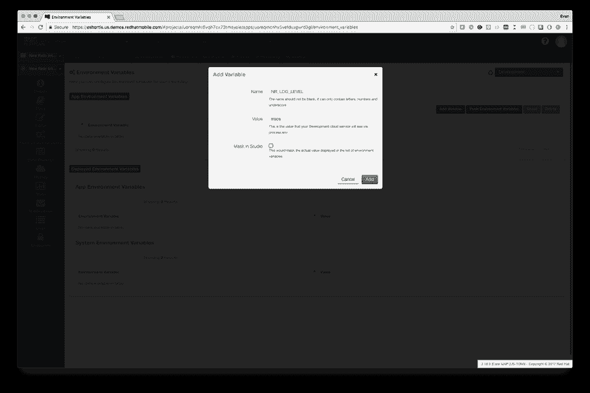

接下来，我们需要定义*NR _ LICENCE _ KEY*变量，但是要这样做我们需要得到我们的 KEY。首先，在[rpm.newrelic.com](https://rpm.newrelic.com/)打开你的新遗迹仪表板，选择窗口顶部的 APM 选项卡。这将显示一个屏幕，您可以在其中选择计划集成的技术堆栈。选择 Node.js，然后在随后的屏幕上单击 *显示许可证密钥* 按钮。它应该看起来像这里的一样。

[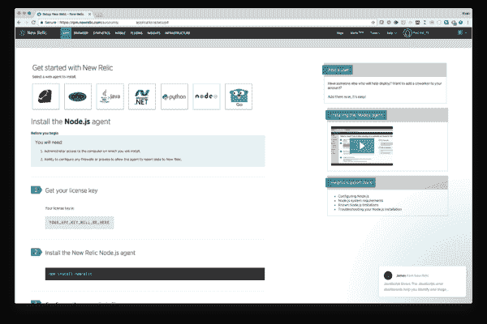](/sites/default/files/blog/2017/09/nr-rhmap8.png)New Relic - Getting Started Screen">

复制密钥，然后将其粘贴到 *环境变量*NR _ LOG _ LEVEL中的*NR _ LICENCE _ KEY*变量的 *值* 字段中，类似于您刚刚定义的*【】NR _ LOG _ LEVEL*。我们也建议在 Studio 框中勾选 *掩码，防止明文可见。*

## 在红帽移动应用平台部署 Node.js 应用

最后，我们将部署 Node.js 云应用程序——这是最简单的部分！

*环境变量* 链接下的是一个 *部署* 链接，点击即可进入部署画面。导航到 *部署* 屏幕，确保在 *中选择 Node.js 4.4.3 或更新版本，选择一个运行时* 下拉菜单，然后点击 *部署云 App* 按钮。进度条将为您提供关于部署过程的更新。

初始部署通常不到 2 分钟，但在极少数情况下，如果应用程序有大量依赖项，部署时间可能会稍长。后续部署会快很多。部署完成后，您应该会在进度条下方的部署日志中看到一个“成功”条目，如下所示:

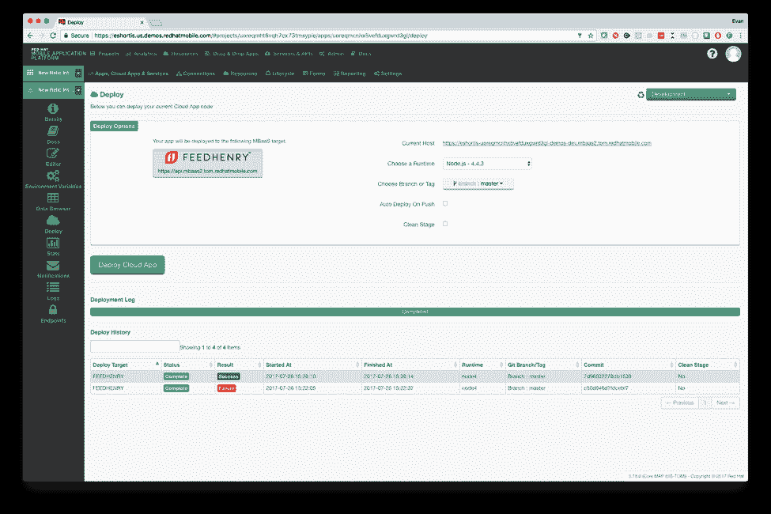

# 为新遗迹生成数据

现在我们的应用程序正在运行，我们应该验证它正在向 New Relic 发送数据。访问 rpm.newrelic.com 的[](https://rpm.newrelic.com/)，选择 APM 选项卡，您应该会看到您的应用程序如下所示。

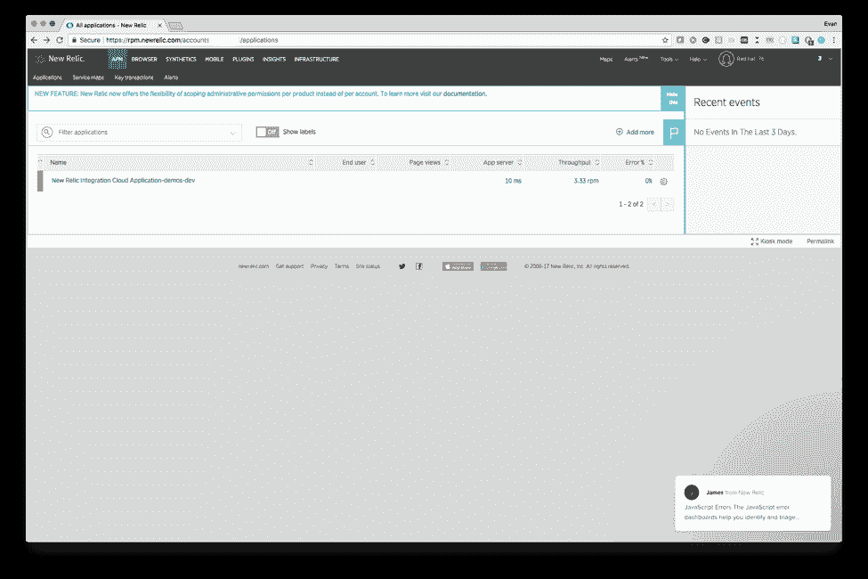

如果您的应用程序没有列出，那么您可能需要验证*NR _ LICENCE _ KEY*是否已设置。您可能还需要等待几分钟，以便 New Relic 使用捕获的数据生成仪表板。

单击应用程序进行查看，您应该已经看到一些活动，即*sys/info/ping*事务。这是红帽的*FH-MBA as-API*express 中间件定义的一个端点。当您查看应用程序时，Red Hat Mobile Application Platform UI 偶尔会对此端点执行 HTTPS 请求。它这样做是为了在 *详细信息* 页面和 web UI 的右上角显示您的应用程序的状态。让我们创建一个我们自己的真实交易。

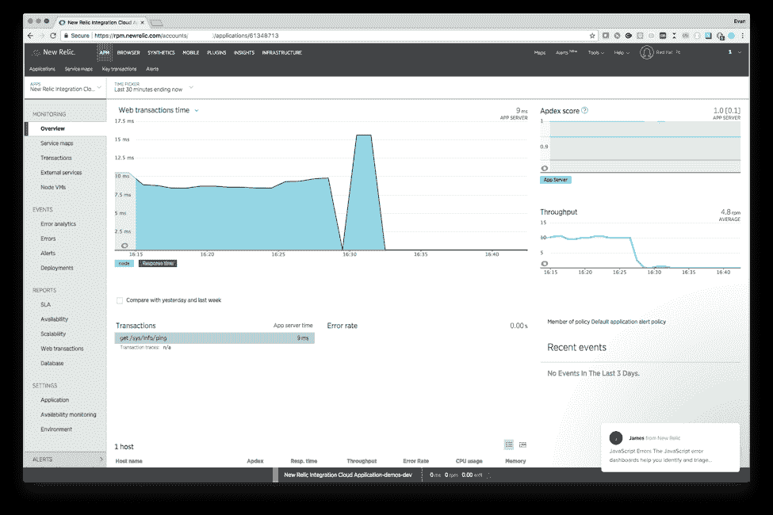

导航回您的云应用的 *详细信息* 或 *部署* 屏幕，点击列出的 URL。它应该会打开一个页面，上面写着:

*您的 Node.js 代码已经部署并运行。该文件由 public/index.html 静态提供*

现在，在网址的最后加上下面的 */hello？hello=RedHat* 并按回车键。这应该响应一个包含“Hello Red Hat”JSON 有效负载，如图所示。

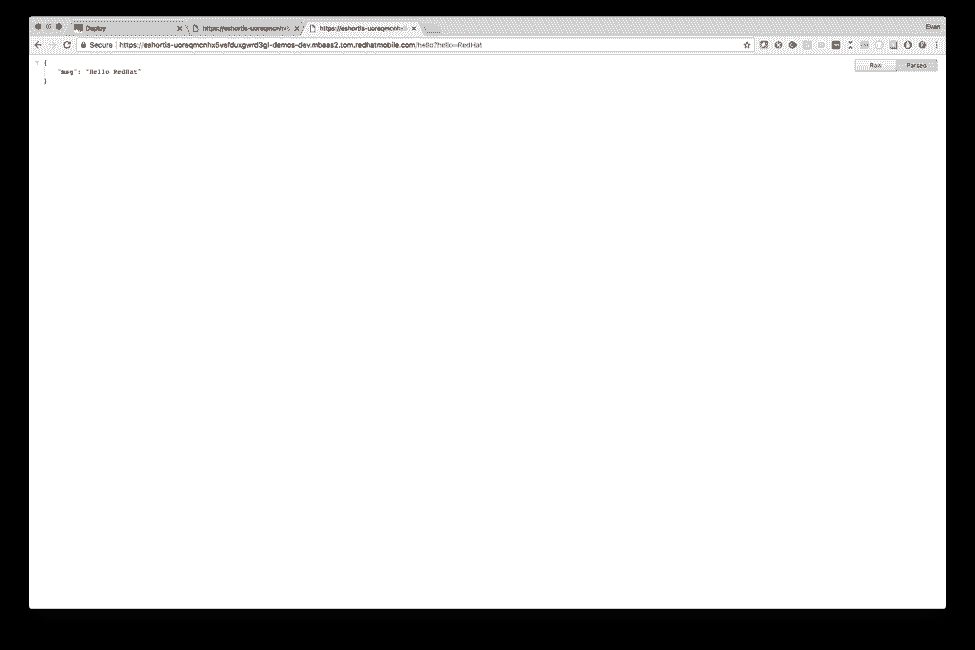

执行完这些请求后，加载 New Relic 中的 *事务* 屏幕，您应该会看到您的应用程序正在执行的各种请求的明细。

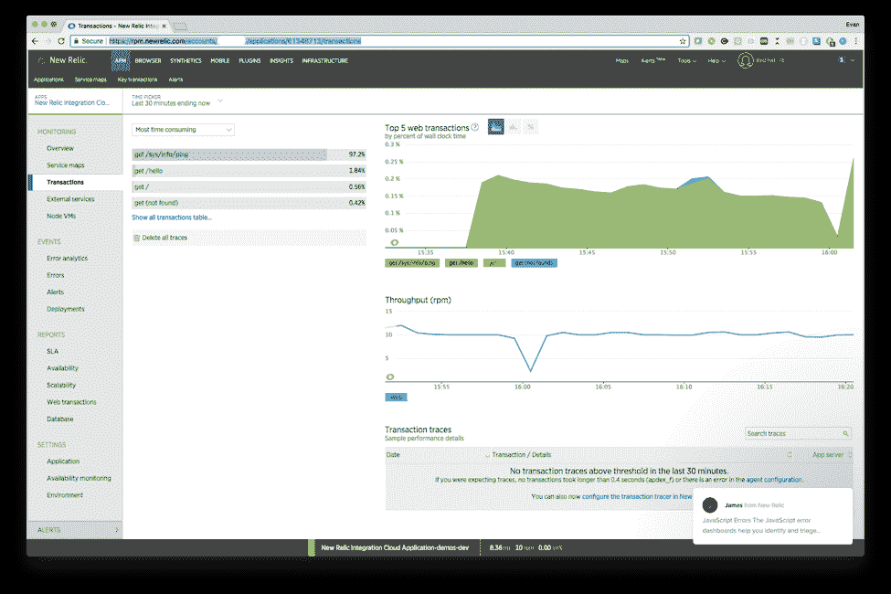

# 添加额外的环境

通常，我们的客户部署多个环境用于*测试**【UAT】*和 *生产* 。值得庆幸的是，New Relic 能够处理这个问题，因为我们已经使用环境变量生成了我们的 New Relic 配置文件，所以我们需要做的就是返回到 Red Hat Mobile Application Platform UI，如下所示选择我们的新环境，必要时更新环境变量，然后在新环境中部署我们的应用程序。

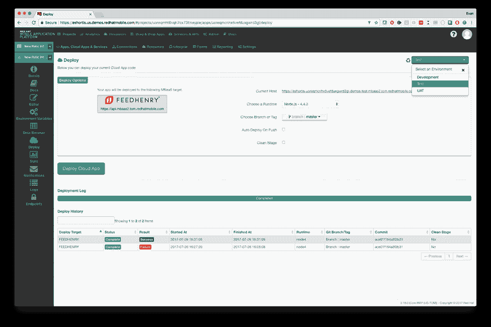

一旦应用程序部署到您的新环境中，您可以导航回 New Relic 仪表板，它应该出现在您现有部署的下方，但在名称的末尾有一个不同的环境。简单！


# 使用 New Relic 进行调试

*注意:下面的例子是特意设计的，在资源有限的虚拟机上运行，演示我们如何调试性能问题。它在一个资源有限的小型虚拟机上执行。与数据库和外部 API 集成的 Production Node.js 应用程序不会显示这些问题，除非它们的负载比下面使用的负载大得多。*

让我们看看如何使用 New Relic 来调试问题。对于这个例子，我们将特意为我们的云应用程序添加一个 CPU 密集型操作——计算斐波那契数。我们首先将这段代码添加到 */hello* 端点之后的 *application.js* 文件中。

```
const fibonacci = require('fibonacci');
app.get('/fibonacci/:iterations', (req, res) => {
  // performs the given number of iterations in a fibonacci sequence
  res.json(fibonacci.iterate(req.params.iterations));
});
```

记住，你还需要将 *Fibonacci* 模块添加到 *package.json* 的*依赖*部分，类似于我们添加*新遗迹*的方式。

使用前面演示的相同方法部署该代码，并将新端点命名为这样的名称*https://$ YOUR _ host . red hat mobile . com/Fibonacci/1500。*响应将包含斐波那契数列中的第 1500 个数字，以及完成计算所花费的时间。使用 Apache Bench 测试几次这个端点，报告说我的服务器每秒只能处理大约 38 个请求！假设您安装了 Apache Bench，您可以自己尝试使用这个命令执行 200 个并发请求来计算斐波那契数列中的第 1500 个数字:

```
$ ab -n 200 -c 200 https://$HOST/fibonacci/1500

```

让我们看一下新的遗迹图，了解一下为什么我们的服务器在处理多个并发请求时会有困难。

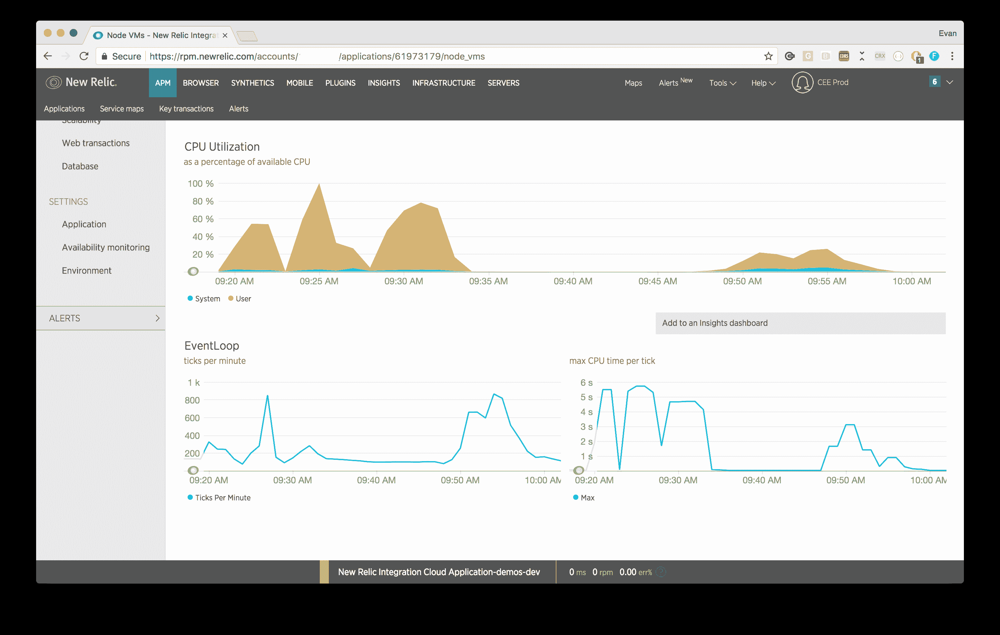

最初，我们在左侧看到高 CPU(黄色峰值)利用率。经过我们的修改，这是显着降低(右)。

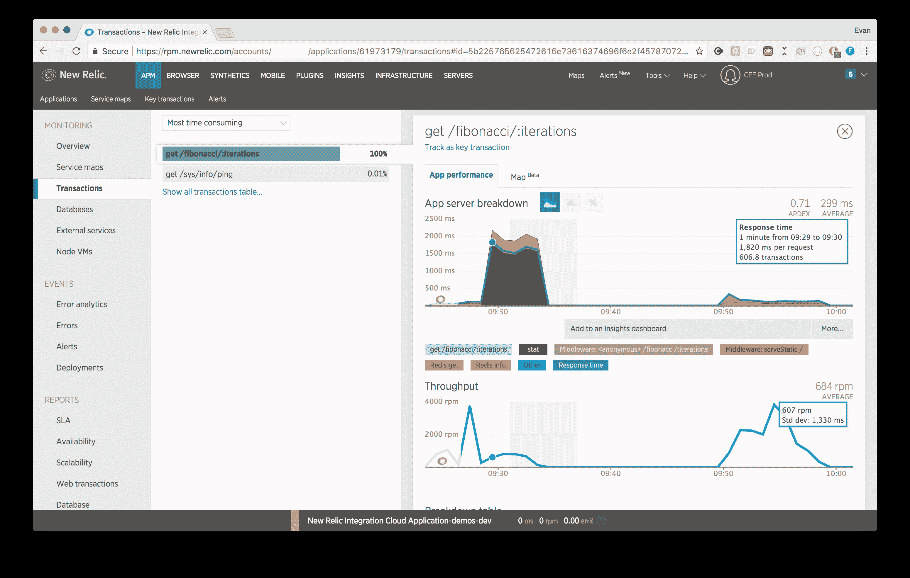

我们的初始响应时间一直超过 1500 毫秒。在我们添加缓存并删除对 express.static 的调用后，它们始终在 100ms 左右。

根据这些图表，很明显我们有两个问题:

1.  高 CPU 利用率首先是显而易见的。
2.  *stat* 和 *serveStatic* 函数(第二幅图中的绿色和棕色峰值)是整体响应时间的重要贡献者。

第一个问题与计算这些数字的方法有关。在 Node.js 生态系统中，数字的计算是以所谓的“阻塞”方式完成的——这意味着在应用程序的 JavaScript 代码中计算序列时，Node.js 服务器的事件循环被阻塞。简单地说，这意味着服务器在计算斐波那契数时不能处理任何其他请求。如果你熟悉 Node.js，你会知道像这样的 CPU 密集型任务应该由一个 [子进程](https://nodejs.org/api/child_process.html) 或更合适的服务来执行，以确保 Node.js 事件循环可以继续处理请求和调度 I/O——这正是它的设计目的！由于响应时间下降，以这种方式阻塞所花费的时间会很明显，这对需要高质量用户体验的移动应用程序来说是不利的。

我们可以将我们的应用在多个内核上进行集群化来缓解这个问题，或者使用[内存化](https://en.wikipedia.org/wiki/Memoization)，但是让我们使用 Red Hat 移动应用平台的缓存功能来提高我们的云应用的吞吐量。在真实的应用程序中，您可以使用缓存以类似的方式减少对企业系统的调用。

我们首先用下面的代码替换现有的 */Fibonacci* 端点代码。这段代码将缓存计算出的数字，以便下一个请求不需要在 60 秒内再次触发昂贵的计算。后续请求将异步检索缓存的结果，以显著增加我们的吞吐量。

```
function getFibonacciEntry (iterations, callback) {
 mbaasApi.cache({
 act: 'load',
    key:`fibonacci-${iterations}`
  }, callback)
}

function setFibonacciEntry (fibonacciResult) {
  mbaasApi.cache({
 act: 'save',
 key:`fibonacci-${fibonacciResult.iterations}`,
 expire: 60,
 value: JSON.stringify(fibonacciResult)
  }, (err) => {
 if (err) {
 console.error(err, 'failed to store entry in cache');
 } else {
 console.log(`stored ${fibonacciResult.iterations} in cache`)
 }
  });
}

app.get('/fibonacci/:iterations', (req, res, next) => {
  getFibonacciEntry(req.params.iterations, onCacheFetched);

  function onCacheFetched (err, data) {
 if (err) {
 // an error occurred - pass it to the error handler
 next(err);
 } else if (data) {
 // we had cached data - return it!
 res.set('content-type', 'application/json');
 res.end(data);
 } else {
 // no entry found in cache - generate the response then store it
 const result = fibonacci.iterate(req.params.iterations);
 setFibonacciEntry(result);
 res.json(result);
 }
  }
});
```

既然我们已经解决了 CPU 利用率的问题，我们可以把精力集中在为这个请求服务所不必要的函数上。根据图表，我们可以确定 Node.js 应用程序正在花费时间执行 *stat* 和 *serveStatic* 函数。这很可能指向我们已经包含在应用程序中的 *express.static* 中间件。由于我们的应用程序不需要这个中间件，我们可以简单地删除它，或者如果您需要使用 *express.static* 中间件，我们可以改变我们的堆栈，以便优先排序这些行，或者它只适用于特定的端点，例如 *public/* :

```
app.get('/fibonacci/:iterations', handlerFunc)

// By placing the static middleware after our routes a
// disk read won't be executed for each incoming request
// unless it reaches this point. We also only execute this
// middleware if the incoming route starts with "/public"
app.use('/public', express.static(__dirname + '/public'));
```

[本文](https://dzone.com/articles/understanding-middleware-pattern-in-expressjs) 提供了快速中间件模式的简明解释，但是主要的要点是您应该确保请求不会通过不必要的中间件函数传递，因为这会增加应用程序的资源利用率和响应时间。

在我们部署了这两个更改之后，我们在这个开发环境中实现了 5.5 倍的增长，达到大约每秒 180 个请求。如果我们看一看启用缓存后的新遗留图表，可以清楚地看到 CPU 利用率大大降低，这意味着我们的应用程序有大量资源可用于完成其工作并同时处理多个请求，这要归功于事件循环不再被阻塞。

* * *

**红帽移动应用平台** [**下载**](https://developers.redhat.com/products/mobileplatform/download/) **，可在** [**红帽移动应用平台**](https://developers.redhat.com/products/mobileplatform/overview/) **了解更多。**

*Last updated: September 22, 2017*