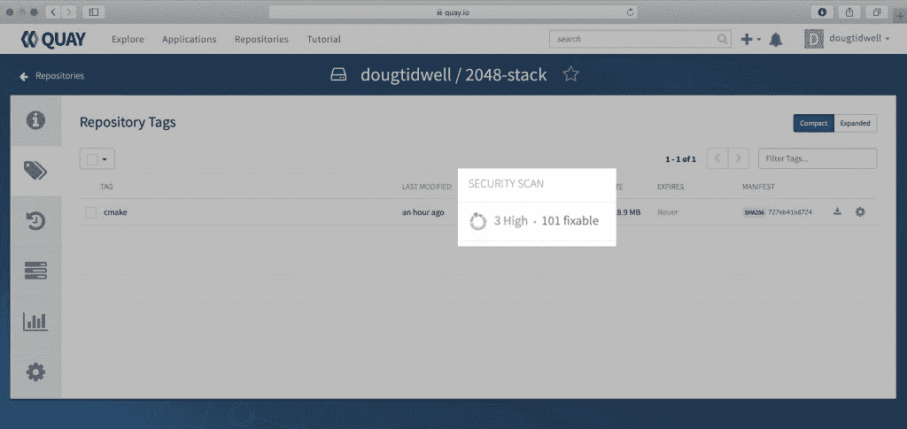
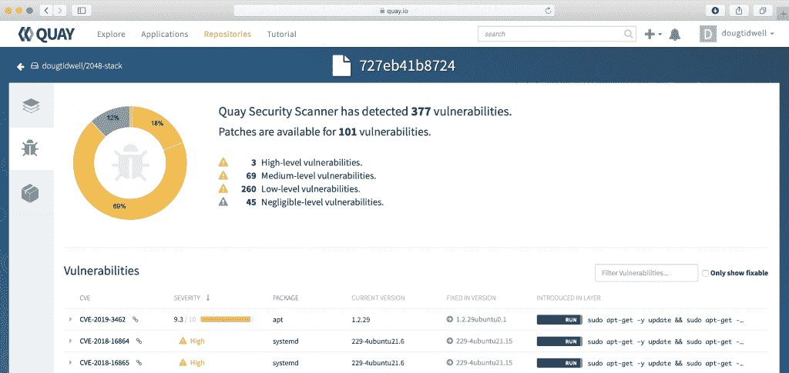
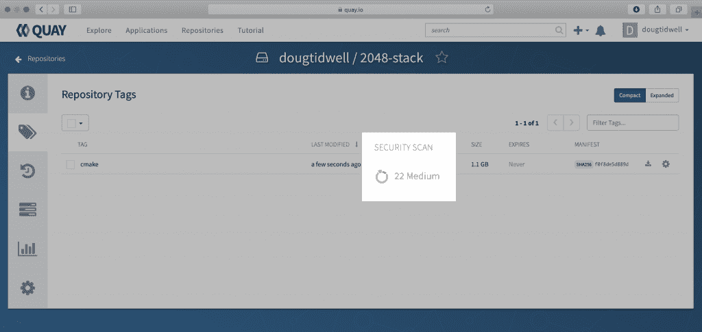
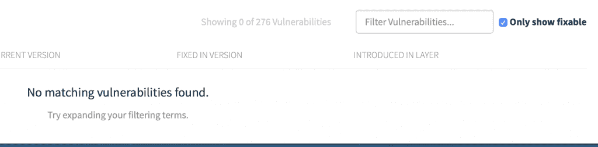

# 使用 Quay.io 查找容器图像中的漏洞

> 原文：<https://developers.redhat.com/blog/2019/06/26/using-quay-io-to-find-vulnerabilities-in-your-container-images>

您已经创建了一个容器映像，其中包含您和您的团队做一些有用的事情所需的所有包，或者您已经创建了一个任何人都可以使用的公共映像。但是，如果该映像包含具有已知安全漏洞的包呢？不管这些漏洞的严重性如何，您都希望了解更多信息，并尽快采取措施缓解它们。

幸运的是，您的团队使用 [Quay.io](https://quay.io) *作为您的注册表。当您将映像推送到 Quay.io 时，它会自动对该映像运行安全扫描。

下面是对几个月前我为[的一篇关于为 Eclipse Che](https://developers.redhat.com/che-custom-stacks/) 创建定制栈的文章[构建的一个图像的最新扫描结果:](https://quay.io/repository/dougtidwell/2048-stack)



正如你所看到的，我沮丧地发现有三个安全漏洞排名*高*。当我建立图像时，他们不在那里；自从我把图像上传到注册表后，它们就被发现了。希望它们包含在 101 个标记为*可修复*的漏洞中。点击 *101 fixable* 会给出一个所有漏洞及其修复的列表——如果有的话——如下图所示。



幸运的是，这三个高漏洞都有修复程序。在此图中，最左边的列列出了每个漏洞的 CVE 数。(CVE 代表[常见漏洞和暴露](https://cve.mitre.org/)，这是一种公开已知问题的参考方法。)单击 CVE 号码旁边的链接图标，您将看到实际的漏洞报告。这些资源将为您提供有关安全扫描所发现问题的所有可用信息。

同样，三个高漏洞都有修复，如版本栏中的*修复所示。如果我们重建图像并将其推回到 Quay.io，它将自动重新扫描。如果我们幸运的话，所有的修复都将被应用，我们的新形象将再次对世界安全。*

我们可以通过确保任何更新和升级都应用到新的映像来提高我们的运气。我的`Dockerfile`是这样开始的:

```
# Base the image on the standard C++ stack
FROM eclipse/cpp_gcc

# Basic system hygiene
RUN sudo apt-get -y update && \
    sudo apt-get -y upgrade && \
```

分配经理的`update`和`upgrade`命令(`apt-get`、`yum`、`dnf`等)。)确保在继续构建映像之前，更新和升级基础映像中的所有包。

**专业提示**:使用 Linux AND 运算符(`&&`)可以让你用一条`RUN`语句执行多个命令。这可以防止你的图像构建工具(`podman`或`docker`)为每个命令创建一个单独的层。

在我重建图像并将其推回 Quay.io 后，安全扫描看起来好多了:



我们现在没有任何高脆弱性。打开报告并点击*只显示可修复的*复选框表明我们正在使用的包存储库还没有针对 Quay 发现的问题的任何修复。



现在是做出判断的时候了。取消选中“仅显示可修复的”将显示整个列表。然后，您可以查看 CVE 报告中的每一项，并决定修复您剩余的漏洞是否至关重要。如果是这样，您也许能够在您使用的软件包仓库之外找到一个补丁。(从发布补丁到它出现在回购中，通常会有几天的延迟。)如果某个补丁存在于其他地方，您必须做一些事情，比如更新您的`Dockerfile`以使用`curl`来获得该补丁，然后使用您平台的安装工具将其添加到您的映像中。

Quay.io 会定期扫描您的图像，因此定期检查您的图像是个好主意。当您这样做时，您将看到映像中任何漏洞的最新列表，以及评估这些漏洞所需的信息。 [Red Hat Quay 也作为一个单独的产品提供](https://www.openshift.com/products/quay),因此您可以创建提供相同功能的私有注册表。

通过 Quay.io 的安全扫描，您可以确保您的图像尽可能安全可靠。

* * *

*尽管美国以外的英语世界将该单词发音为“key”，但该产品的官方发音为“kway”(谷歌翻译也把它发音为“key”。)我只是这里的信差。

*Last updated: September 3, 2019*