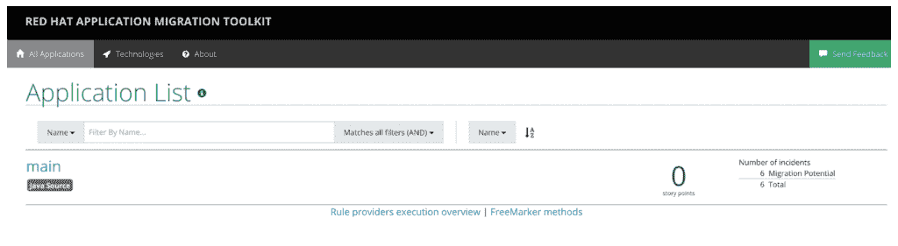
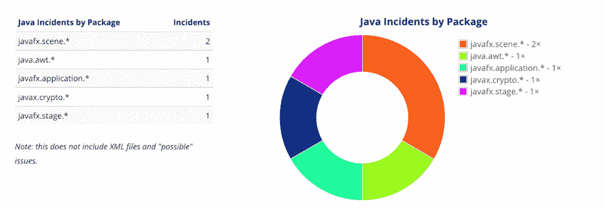
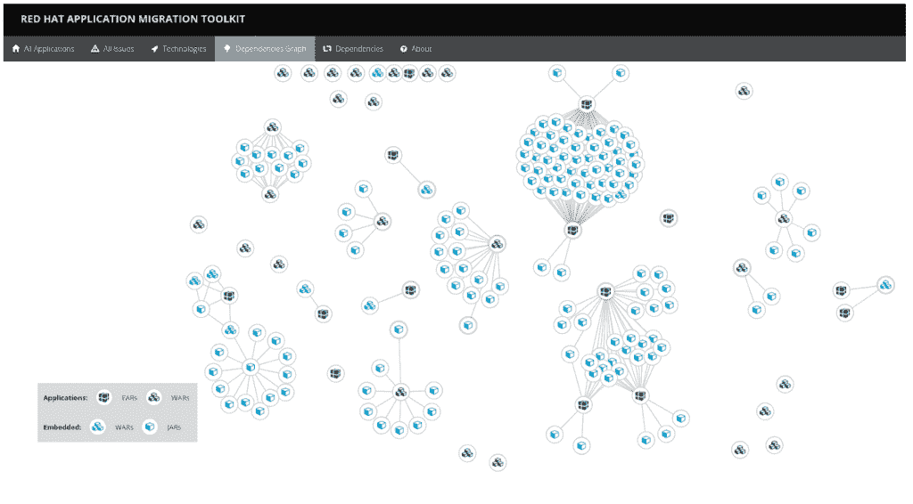

# 使用 Red Hat Application Migration Toolkit 查看迁移到 OpenJDK 的影响

> 原文：<https://developers.redhat.com/blog/2019/01/09/using-red-hat-application-migration-toolkit-to-see-the-impact-of-migrating-to-openjdk>

从一个软件解决方案迁移到另一个是所有优秀的软件开发人员都需要计划的现实。无论您是开发内部使用的软件，还是从供应商处购买软件，拥有一个计划都有助于持续推动创新。无论哪种情况，从不预测或规划迁移都会危及整个创新价值主张。在当今不断变化的软件世界中，每个想要从云的成功中受益的人都必须确保云创新是持续的。因此，维护一个随着技术进步而变化的堆栈是必要的。

在本文中，我们将看看迁移到 OpenJDK 的影响，其结果将有助于得出进一步的结论和进行规划。使用 JDK 的专有版本是很常见的，本文将介绍如何使用[Red Hat Application Migration Toolkit](https://developers.redhat.com/products/rhamt/overview/)来分析您的代码库，以了解迁移到 OpenJDK 的影响。

## 什么是红帽应用迁移工具包？

red Hat Application Migration Toolkit 是一个可定制和可扩展的基于规则的工具，它寻找公共资源，并在需要迁移时突出显示技术和已知的潜在影响领域。它可以与 Maven 之类的工具一起使用，并从运行中生成可以在浏览器中查看的报告。它也有基于浏览器的工具来做同样的事情。

目标是提供一个像 Java 这样的技术的使用的高层次视图，以及如何将它们移植到最新版本的 OpenJDK 或[Red Hat JBoss Enterprise Application Platform](https://developers.redhat.com/products/eap/overview/)或者甚至从其他[容器](https://developers.redhat.com/blog/category/containers/)中移植。目标是给出一个总体影响分析，这将有助于评估、文档和迁移。有关 Red Hat 应用程序迁移工具包的更多详细信息，请访问参见[文档](https://access.redhat.com/documentation/en-us/red_hat_application_migration_toolkit/4.2/html-single/getting_started_guide/#about_gs_guide)。

## Red Hat 应用程序迁移工具包入门

Red Hat 应用程序迁移工具包有以下不同的接口。为了简单起见，我们将坚持 Maven 的例子。无论如何，以下链接应该有助于提供更多信息:

*   CLI
*   [网络控制台](https://access.redhat.com/documentation/en-us/red_hat_application_migration_toolkit/4.2/html-single/getting_started_guide/#about_the_web_console)
*   [Eclipse 插件](https://access.redhat.com/documentation/en-us/red_hat_application_migration_toolkit/4.2/html-single/getting_started_guide/#about_the_plugin)
*   [Maven 插件](https://access.redhat.com/documentation/en-us/red_hat_application_migration_toolkit/4.2/html-single/getting_started_guide/#about_maven)

让我们开始吧。我们需要设置运行 Red Hat 应用程序迁移工具包的先决条件。

### 正在安装 OpenJDK

Red Hat 应用程序迁移工具包已经在 Linux、Windows 和 macOS 上进行了测试。其他支持 Java 8+的操作系统应该也能很好地工作，Oracle JDK 8 也能工作，假设你有一个运行 JDK 的设置。

如果你运行的是[红帽企业版 Linux](https://developers.redhat.com/products/rhel/overview/) 7，`rpms`可以在 rhel `-7-server-` rpms 频道找到。

运行以下命令安装 OpenJDK:

```
$ sudo yum install java-1.8.0-openjdk-devel.x86_64
```

关于安装 OpenJDK 的详细说明也可以在[这里](https://developers.redhat.com/blog/2018/11/05/migrating-from-oracle-jdk-to-openjdk-on-red-hat-enterprise-linux-what-you-need-to-know/)找到。(如需启用`sudo`，请参见[本文](https://developers.redhat.com/blog/2018/08/15/how-to-enable-sudo-on-rhel/)

### 安装 Maven

现在，我们还必须确保安装了 Maven。先在这里下载[。](http://maven.apache.org/download.cgi)

下载完成后，按照下面的说明进行操作，假设您在 Red Hat Enterprise Linux 上运行它。

将 ZIP 存档文件解压到您希望安装 Maven 的目录。

在终端`vi ~/.bash_profile`中打开您的`.bash_profile`文件。

将`M2_HOME`环境变量添加到文件中:

```
export M2_HOME=/path/to/your/maven (this is where you have extracted maven archive)
```

现在让我们将 Maven 的`bin`目录添加到我们的路径中，这样我们就可以在我们的系统中使用它了:

```
export PATH=$M2_HOME/bin:$PATH
```

确保将`JAVA_HOME`设置为 OpenJDK 的安装位置，例如:

```
export JAVA_HOME=/usr/lib/jvm/java-1.8.0-openjdk.x86_64
```

确保`$JAVA_HOME/bin`在您的`PATH`环境变量中。

保存文件并退出文本编辑器。

打开一个新的终端并运行以下命令来验证 Maven 是否已成功安装在您的机器上:

```
$ mvn --version
```

例如，如果你有`epel-apache-maven` repo，也可以通过`yum`安装 Maven。

现在已经有了一个正在运行的 Java 和 Maven 安装，让我们开始使用 Red Hat 应用程序迁移工具包。

如果你有一个当前的 Java 项目，需要进行分析；否则可以在这里下载[下面的示例项目。](https://github.com/sshaaf/jdk-migration-example)

### 运行 Red Hat 应用程序迁移工具包

让我们通过示例项目来熟悉设置。

要在项目中使用 Red Hat Application Migration Toolkit，请将以下插件添加到 POM 文件的`build`部分。在示例项目中，这已经存在。

```
<plugin>
<groupId>org.jboss.windup.plugin</groupId>
<artifactId>windup-maven-plugin</artifactId>
<version>4.2.0.Final</version>
<executions>
  <execution>
    <id>run-windup</id>
    <phase>package</phase>
    <goals>
      <goal>windup</goal>
    </goals>
  </execution>
</executions>
<configuration>
  <offlineMode>true</offlineMode>
  <windupVersion>4.2.0.Final</windupVersion>
</configuration>
</plugin>
```

这将允许 Red Hat 应用程序迁移工具包在构建期间运行。

通过终端，导航到项目目录，并使用以下命令在终端上执行构建。

```
$ mvn clean install
```

### 查看分析报告

根据源代码，构建可能需要一些时间。它将确保下载 Red Hat 应用程序迁移工具包，并执行分析，以一个漂亮的报告结束。构建完成后，可以通过项目中的以下目录访问结果:

```
target/windup-report/index.html
```

让我们通过在浏览器中打开页面来浏览结果:

[](https://developers.redhat.com/blog/wp-content/uploads/2018/12/Screen-Shot-2018-12-18-at-10.30.00-AM.png)

在浏览器中，您可以看到潜在的迁移区域以及应用程序名称。单击“main”，这将导航到详细信息页面:

[](https://developers.redhat.com/blog/wp-content/uploads/2018/12/Screen-Shot-2018-12-18-at-10.29.48-AM.png)

从 Oracle JDK 迁移到 OpenJDK 时，基于 JDK 的版本会有所不同。在上面显示的报告中，报告了事件，即不能与 OpenJDK 一起工作的 API。在上面的例子中，报告了我们应用程序中的`javafx`，以及`crypto`和`awt`。

让我们通过单击“问题”选项卡来更详细地了解一下这些事件是什么。

[](https://developers.redhat.com/blog/wp-content/uploads/2018/12/Screen-Shot-2018-12-18-at-10.30.17-AM.png)

上面的截图清楚地解释了从 Oracle JDK 迁移到 OpenJDK 版本 8 时的不兼容性。此外，还提供了详细信息，包括知识库链接以及可以采取的补救措施的描述。这些提示应该提供指导，并有助于估计在类或每行的基础上更改代码所需的工作量。

进一步来说，作为项目领导，您可能还想知道依赖关系以及它们是如何映射的。red Hat Application Migration Toolkit 对它所分析的所有代码都进行了详细的分析。下面是说明这一点的另一个截图:

[](https://developers.redhat.com/blog/wp-content/uploads/2018/12/Screen-Shot-2018-12-18-at-10.30.29-AM.png)

## 结论

上面的例子展示了迁移过程中一些受影响的区域，以及 Red Hat Application Migration Toolkit 对于此类项目的有用性。

还有很多更有趣的功能。要进一步阅读，请访问文档页面[此处](https://access.redhat.com/documentation/en-us/red_hat_application_migration_toolkit/4.2/)。

如果你想试试上面的例子，它也在 GitHub [repo](https://github.com/sshaaf/jdk-migration-example.git) 中与示例代码和 Maven POM 文件共享。

## 额外资源

*   [从 Oracle JDK 迁移到 Red Hat Enterprise Linux 上的 OpenJDK:您需要了解的内容](https://developers.redhat.com/blog/2018/11/05/migrating-from-oracle-jdk-to-openjdk-on-red-hat-enterprise-linux-what-you-need-to-know/)
*   [Red Hat Application Migration Toolkit 4.2 的新增功能，包括 Oracle JDK 到 OpenJDK 迁移](https://www.redhat.com/en/blog/whats-new-red-hat-application-migration-toolkit-42-including-oraclejdk-openjdk-migration?source=bloglisting)
*   [Red Hat 应用程序迁移工具包简介](https://developers.redhat.com/blog/2018/06/01/an-introduction-to-red-hat-application-migration-toolkit/)

*Last updated: May 1, 2019*