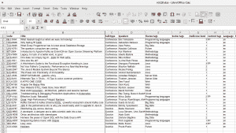
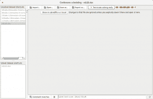
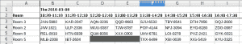
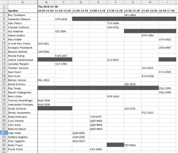

# 使用 OptaPlanner 计划 2018 年苏黎世的 Voxxed 日

> 原文：<https://developers.redhat.com/blog/2018/02/19/voxxed-days-zurich-2018>

我是马里奥·富斯科，我很荣幸连续第三年担任苏黎世 voxed Days 的项目委员会主席。阅读、评估、讨论并从每年收到的 200 多份提案中进行选择是一个漫长而富有挑战性的过程。我必须承认，在我开始做这项工作的第一年，我很大程度上低估了这项任务。不仅要评估每份提交材料的质量，还要评估它们之间的契合度。最后，最糟糕的是不得不拒绝这么多令人难以置信的提议，因为名额有限。

然而，一旦选择了所有会谈，并且发送了所有批准和拒绝的电子邮件，该过程仍未完成。现在是时候接受所有被接受的谈话并安排实际的项目了。即使对于像苏黎世 voxed Days 这样的中等规模的活动(会议仅持续一天，我们有四个平行轨道)，这也不是一个微不足道的任务。你可能需要考虑许多约束和有利条件。例如，一些发言者将在上午晚些时候到达，或者将不得不在下午早些时候离开。有些讲座需要不同的房间容量。不得同时安排属于同一轨道的两个讲座。这个过程有更多的变量。

在过去的两年里，我花了整整一个周日下午喝一两杯威士忌(在这个过程中达到鲍尔默巅峰真的很重要)，并在 Excel 电子表格上移动会谈，直到我达到足够令人满意的情况。

今年，我决定采取不同的方法。我的同事杰弗里·德·斯梅特是 OptaPlanner 的项目负责人。我发现他正在开发一个优化会议安排的应用程序，这是他的项目中已经有的许多例子之一。Geoffrey 建议我试一试，并根据我之前的经验向他提供反馈。

## 设置会议数据

我接受了挑战，并使用会议日程安排应用程序预期的格式将计划委员会批准的会谈添加到电子表格中，从而获得以下内容:

在这里，除了每个对话所属的音轨之外，您还可以指定附加标签:

1.  演讲的难度——你可能想确保技术含量较低的与会者至少会有一个有趣的演讲。
2.  主题-在这种情况下，有几个关于函数式编程的讲座属于不同的轨道，不应该安排在同一时间。
3.  语言-在苏黎世，所有的谈话都是用英语，所以我在语言方面没有任何问题。然而，我在瑞士的意大利语区提契诺组织了另一个 Voxxed Days 活动。对于这次活动，我想确保讲英语和意大利语的客人都能参加。

电子表格中还有一些其他选项卡，允许您为会议配置不同的房间并对其进行标记，列出所有发言者及其时间限制，以及指定应该在具有特定标记的房间中安排一次发言。这方面的一个例子是最大的房间容量或记录谈话的房间。

## 运行 OptaPlanner

在电子表格中配置好所有内容后，您就可以启动会议安排应用程序并将其输入到电子表格中了。然后等待几秒钟，直到 OptaPlanner 为您的会议计算出完美的时间表。
注意:时间可能会有很大变化，这取决于问题的规模以及您设置的硬约束和软约束的数量:

我是在 OptaPlanner 还在计算最优解的时候拍的前一张截图。请注意，当前分数显示为:-2 硬/-50 软。又过了几秒钟，OptaPlanner 找到了得分为 0 硬/0 软的最佳解决方案。可以将此解决方案导出为第二个电子表格，显示最终的最佳时间表。在这种情况下，房间视图如下所示:

在“演讲者”视图中，您只需看一眼就能知道每位演讲者将在何时何地进行演讲:

总之，我最终制定了一份非常令人满意的日程表，并公布在会议网站上。总的来说，能够抛弃旧的完全手动的过程并尝试 OptaPlanner 是一种很好的体验。它不仅允许我用最少的努力在几分钟内安排好整个会议(以前需要半天的麻烦)，还允许我用不同的约束集进行许多模拟。像这样的问题:“如果我想让这个扬声器在一个更大的房间里，会发生什么？”，或者“我可以避免同时进行这两个讲座吗，即使它们属于不同的轨道？”，用我一直使用的传统方法会非常困难。

现在[最终的会议日程](https://cfp-vdz.exteso.com/2018/byday/thursday)已经就绪，我作为项目委员会负责人的所有工作已经完成。我将能够享受这次活动，并从我们挑选的出色的演讲者身上学到尽可能多的东西。