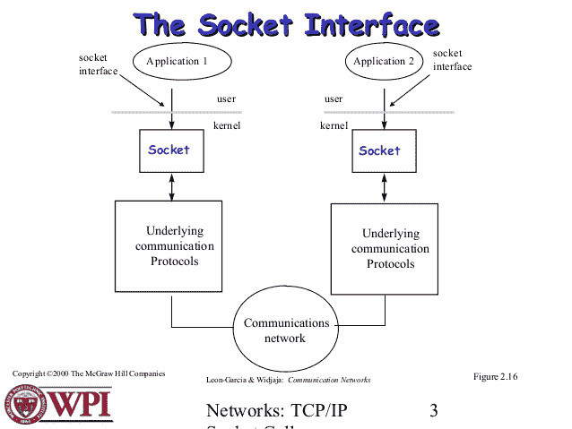

# 什么是插座？

> 原文：<https://developers.redhat.com/blog/2017/10/17/what-is-a-socket>

最近，在查看 FAQ 时，我遇到了一个问题“什么是套接字？”对于那些不熟悉的人，我来解释一下。

简而言之，Unix 套接字(从技术上讲，正确的名称是 Unix 域套接字， **UDS** )允许客户机-服务器应用程序框架中同一台机器或不同机器上的两个不同进程之间的通信。更准确地说，这是一种使用标准 Unix 描述符文件在计算机之间进行通信的方式。

每个 UNIX 系统的输入/输出操作都是通过写入或读取描述符文件来执行的。描述符文件是一个打开的文件，它与一个整数相关联。它可以是网络连接、文本文件、终端或其他东西。它的外观和行为很像一个低级文件描述符。这是因为 read()和 write()这样的命令与它们处理文件和管道的方式相同。

## 插座的类型

有四种类型的插座。

前两种类型比后两种类型更常用:

### 流套接字

网络环境中的交付是有保证的。这些使用 TCP(传输控制协议)进行数据传输。

流套接字是一种进程间通信套接字或网络套接字，它提供面向连接的、有序的、唯一的数据流，没有记录边界，具有定义明确的机制来创建和销毁连接以及检测错误。

流套接字可靠、有序地传输数据，并具有带外功能。如果你发送三个项目“A、B、C ”,那么收件人会以同样的顺序收到。

### 数据报套接字

网络环境中的交付没有保证。这些 UDP(用户数据报协议)用于数据传输。

### 原始套接字

这些为用户提供了对支持套接字抽象的底层通信协议的访问。它们不是为一般用途设计的。

### 有序数据包套接字(SPS)

类似于流套接字的有序分组套接字，不同之处在于记录边界被保留。SPP 接口仅作为网络系统套接字抽象的一部分提供，在大多数重要的网络系统应用程序中非常重要。

它允许用户修改一个数据包或一组数据包上的 SP 协议报头，方法是沿着要发送的任何数据编写一个原型报头，或者指定一个默认报头用于所有传出数据。

SPS 允许用户接收传入数据包的报头。

上面定义的过程是在相同类型的套接字之间进行通信。但是不同类型的套接字之间的通信没有限制。

## **通信**

你可以在这里找到更多关于 Unix 套接字的一般信息。

* * *

**无论你是容器新手还是有经验的人，下载这个** [**备忘单**](https://developers.redhat.com/promotions/docker-cheatsheet/) **可以在遇到你最近没有完成的任务时帮助你。**

*Last updated: October 16, 2017*