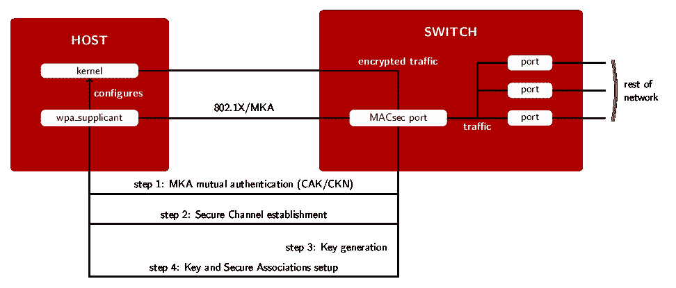
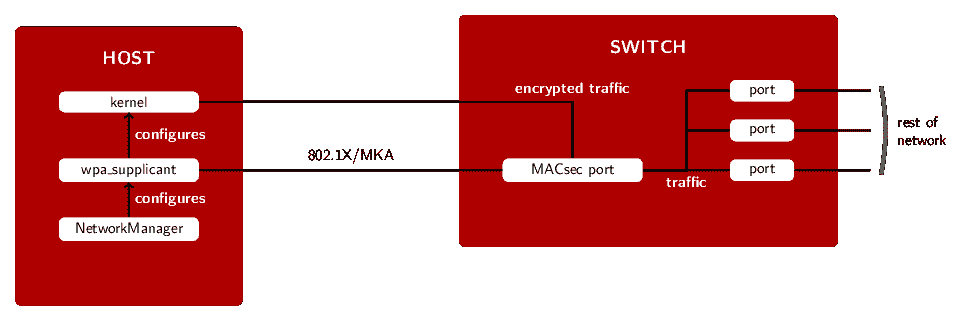

# MACsec 的新特性:使用 wpa_supplicant 和(可选)NetworkManager 设置 MACsec

> 原文：<https://developers.redhat.com/blog/2017/06/28/whats-new-in-macsec-setting-up-macsec-using-wpa_supplicant-and-optionally-networkmanager>

几个月前，在这个博客上，我们[谈到了 MACsec](http://developers.redhat.com/blog/2016/10/14/macsec-a-different-solution-to-encrypt-network-traffic/) 。在这篇文章中，我想介绍一下从那以后我们所做的工作。由于这项工作是围绕配置 MACsec 的方法展开的，因此它也将作为通过两种方法配置 MAC sec 的指南:单独使用 wpa_supplicant，或者使用带有 wpa_supplicant 的 NetworkManager。

如果你读了 MACsec 以前的文章，你可能会认为生成密钥和创建“安全关联”的整个过程并不方便，特别是考虑到你必须监控你的关联并手动生成新的密钥。你是对的:事实并非如此。

此外，如果你运行 RHEL 或 Fedora，你可能习惯于用 NetworkManager 配置你的网络，所以你也可以用 NetworkManager 配置 MACsec。我们将在下面对此进行描述。首先，让我们回到幕后。

## 与 wpa_supplicant 集成

"*wpa _ 恳求者？等等，那不是 WiFi 的东西吗？*“不见得吧！在 [wpa_supplicant](http://w1.fi/wpa_supplicant/) 主要用于 WiFi 的同时，还处理与 [802.1X](https://en.wikipedia.org/wiki/IEEE_802.1X) 的基于端口的认证。在使用 802.1X 的网络中，您的交换机端口实际上是关闭的，直到您的机器上运行的某个东西(*请求者*)向网络的其余部分进行认证(或者更确切地说，一个称为*认证者*的特定实体)。

### MACsec 密钥协议

对于 MACsec，我们更进一步，使用 802.1X 的扩展，称为 MACsec 密钥协商协议(MKA，在 IEEE 802.1X-2010 的[中描述)，来设置所需的安全通道和关联，并在节点之间执行密钥交换。在这个设置阶段之后，你的流量将被 MACsec 保护。wpa_supplicant 还将保持运行，以确保您的关联保持最新，并在必要时执行新的密钥交换(在当前密钥过期之前，以提供无缝过渡)。](http://standards.ieee.org/getieee802/download/802.1X-2010.pdf)

具体来说，事情是这样的:

*   *主机上的 wpa_supplicant* 与交换机 MACsec 端口上的 MKA 代理通信(可以有多个端口)。
*   在步骤 1[【1】](#cak-fn1)中主机和交换机相互认证后，它们都配置了一对具有匹配标识符的安全通道(步骤 2)。
*   然后，交换机将为每个方向生成一个密钥(步骤 3)。这些密钥将用于加密和解密实际流量。
*   在步骤 4 中，主机和交换机上都配置了使用这些密钥的安全关联。
*   *wpa_supplicant* 翻译通过 MKA 获得的信息，并配置内核的 MACsec 实现。
*   从那时起，内核在“macsec0”接口上发送由 MACsec 保护的数据包，这是一个专用于加密流量的独立网络设备。
*   在 wpa_supplicant 保持运行的同时，稍后重复步骤 3 和 4(根据需要重复多次),以便在当前密钥过期时转换到新密钥。

[](https://developers.redhat.com/blog/wp-content/uploads/2017/06/wpa_supplicant.png)

### 配置示例

如果您将 MACsec 与使用预共享 CAK/CKN 对来执行身份验证的交换机一起使用，您应该在 wpa_supplicant 配置文件中添加以下内容:

```
ctrl_interface=/var/run/wpa_supplicant
eapol_version=3
ap_scan=0
fast_reauth=1

network={
        key_mgmt=NONE
        eapol_flags=0
        macsec_policy=1

        mka_cak=0011... # 16 bytes hexadecimal
        mka_ckn=2233... # 32 bytes hexadecimal
}

```

你必须选择一个 CAK/CKN 对[【2】](#cakgen-fn1)，并在你的交换机上设置它。这与在 WiFi 上使用 WPA-PSK 非常相似。

并且，假设您使用 eth0 连接到您的网络，那么您应该以这种方式启动 wpa_supplicant:

```
# wpa_supplicant -i eth0 -Dmacsec_linux -c wpa_supplicant.conf
```

请注意，您的 wpa_supplicant 版本可能不支持 Linux 内核实现的 MACsec，因为这个特性是最近才出现的，还不是 wpa_supplicant 已发布版本的一部分(撰写本文时的当前版本是 v2.6，不包含 macsec_linux 驱动程序)。在 Fedora 上，如果你已经安装了 wpa_supplicant 2.6-4 或更新版本(在 Fedora 26 中)，这是可用的。

您可以通过运行`wpa_supplicant -h`，并在命令输出的`drivers:`部分查找`macsec_linux`，来检查您的 wpa_supplicant 版本是否支持带有 Linux 内核的 MACsec。例如，在 Fedora 26 机器上:

```
# wpa_supplicant -h
wpa_supplicant v2.6
Copyright (c) 2003-2016, Jouni Malinen  and contributors

[...]

drivers:
  nl80211 = Linux nl80211/cfg80211
  wext = Linux wireless extensions (generic)
  wired = Wired Ethernet driver
  macsec_linux = MACsec Ethernet driver for Linux
options:
[...]

```

您也可以使用 wpa_supplicant 在两台或多台机器之间建立“ad-hoc”MAC sec 网络。为此，您将需要一个转发 802.1X 帧的交换机(默认情况下，Linux“桥”模块不这么做[【3】](#bridge-fn1)；“哑”开关可能会让它们通过；更高级的交换机可能不会)。

然后，您只需要在您所有的机器上配置并运行 wpa_supplicant，就像上面所做的那样。

## 网络管理器

1 月份发布的 NetworkManager 1.6 支持通过 wpa_supplicant 配置 MACsec 连接。和前面的例子一样，我们需要指明我们想要使用这个预共享密钥模式，指定 CAK/CKN 对，以及我们想要用来连接到网络的链路。

下图应该看起来很熟悉:这个设置和前一个设置的主要区别在于管理员与哪个软件进行交互。

[](https://developers.redhat.com/blog/wp-content/uploads/2017/06/NetworkManager.png)

下面是相当于前面`wpa_supplicant`配置的 nm CLI【T1【4】命令:

```
MKA_CAK=0011... # 16 bytes hexadecimal
MKA_CKN=2233... # 32 bytes hexadecimal

nmcli connection add type macsec \
      con-name test-macsec+ ifname macsec0 \
      connection.autoconnect no \
      macsec.parent eth0 macsec.mode psk \
      macsec.mka-cak $MKA_CAK \
      macsec.mka-cak-flags 0 \
      macsec.mka-ckn $MKA_CKN

nmcli connection up test-macsec+

```

仅此而已。然后，可以以通常的方式使用 NetworkManager 来配置 IP 地址等。

和以前一样，您需要选择一个 CAK/CKN 对，并在您的对等机(另一台 Linux 机器或交换机)上配置它们。这是“预共享 CAK/CKN”模式的基本要求。

## 结论

这篇文章描述了如何使用网络管理器结合 wpa_supplicant 或者直接使用 wpa_supplicant，以一种方便的方式部署 MACsec，而不需要持续的监控。

Fedora 26 将附带 NetworkManager 1.8 和一个支持 MACsec 的 wpa_supplicant 版本。支持 MACsec 的 NetworkManager 和 wpa_supplicant 的软件包也将在 RHEL 7.4 中提供。

* * *

脚注:

1.  通过验证 CAK/CKN 对-连接关联密钥/CAK 名称(参见 [IEEE 802.1X-2010](http://standards.ieee.org/getieee802/download/802.1X-2010.pdf) 了解更多详情)-匹配来完成相互认证。([回去](#cak-back1))
2.  You can, for example, generate a 16-byte key in hexadecimal notation this way:

    ```
    dd if=/dev/urandom count=16 bs=1 2> /dev/null | hexdump -e '1/2 "%02x"'
    ```

    ([回去](#cakgen-back1)

3.  To be precise: by default, the Linux bridge module blocks traffic to group addresses (of the form 01-80-C2-00-00-0X). This can be changed with the group_fwd_mask setting:

    ```
    echo 8 > /sys/class/net/$BRIDGE/bridge/group_fwd_mask
    ```

    ([回去](#bridge-back1)

4.  关于 nmcli 的更多信息可在 [Fedora 项目 wiki](https://fedoraproject.org/wiki/Networking/CLI) 上获得。([回去](#nmcli-back1))

*Last updated: June 26, 2017*