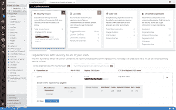
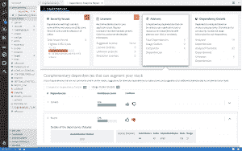

# Red Hat 依赖分析的新特性

> 原文：<https://developers.redhat.com/blog/2019/10/15/whats-new-in-red-hat-dependency-analytics>

我们很高兴地宣布 Red Hat Dependency Analytics 的新版本，该解决方案使开发人员能够直接从他们的 IDE 中评估和添加高质量的开源组件，从而创建更好的应用程序。

Red Hat Dependency Analytics 帮助您的开发团队在构建应用程序时避免安全和许可问题。它插入到开发人员的 IDE 中，自动分析您的软件组成，并提供建议来解决您的团队可能遗漏的安全漏洞和许可问题。

事不宜迟，让我们直接进入这个版本中提供的新功能。这个版本包括一个新版本的 IDE 插件和由 Red Hat 托管的服务器端分析服务。

### 支持 Python 应用程序

除了 [Java](https://developers.redhat.com/developer-tools/java) (maven)和 JavaScript (npm)，依赖性分析现在为 Python (PyPI)应用程序提供了全套功能。从您的 IDE 中，您可以对 Python 应用程序的“requirements.txt”文件执行漏洞和许可证分析，合并建议的修复，并生成堆栈分析报告以获得更多详细信息。

[https://www.youtube.com/embed/sy2gUH2iPOg?autoplay=0&start=0&rel=0](https://www.youtube.com/embed/sy2gUH2iPOg?autoplay=0&start=0&rel=0)

### 基于当前漏洞数据的软件组合分析

估计每天有 15，000 个开源包被更新。平均而言，JavaScript (npm)和 Python (PyPi)包中每天都会出现三个新的漏洞。在这个新版本中，由 Red Hat 托管的服务器端分析服务自动处理它所跟踪的开源包的每日更新。托管服务还自动接收发布到国家漏洞数据库 (NVD)的 JavaScript 和 Python 包的新漏洞数据。这允许 IDE 插件和 API 调用提供基于当前漏洞和发布数据的源代码分析。

### 分析传递依赖关系

除了应用程序中包含的直接依赖项之外，依赖项分析现在还利用包管理器来发现这些依赖项的依赖项，并将其添加到应用程序的依赖图中，这些依赖项称为“可传递的”依赖项。对应用程序的分析是在整个图模型中执行的，修复建议是在整个依赖集内提供的。

### 关于补充性开源库的建议

在这个版本中，Dependency Analytics 希望推荐高质量的开源库，作为应用程序中所包含的依赖项的补充。托管服务的机器学习技术收集和分析 GitHub 上的各种统计数据，以管理高质量开源库的列表，这些库可以添加到当前的依赖项集，以增强您的应用程序。您可以通过单击针对每条建议显示的“赞成”或“反对”图标来提供您对附加库的反馈。系统会自动处理您的反馈，以提高推荐的质量。

### IDE 插件支持

依赖分析 IDE 插件现在可用于 VS 代码、Eclipse Che 和任何 JetBrains IDE，包括 IntelliJ 和 PyCharm。

我们将持续发布依赖性分析解决方案的新更新，以便您可以最大限度地减少由于最后一刻的安全和许可相关问题而导致的应用交付延迟。

敬请关注进一步的更新；我们期待您对依赖性分析的反馈。

*Last updated: July 1, 2020*