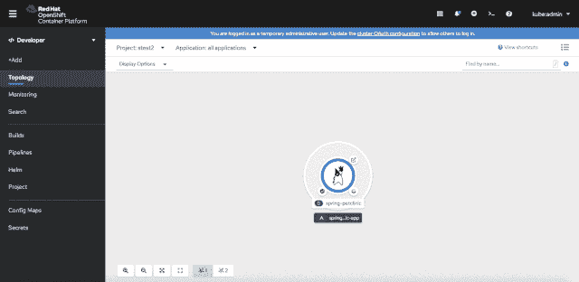
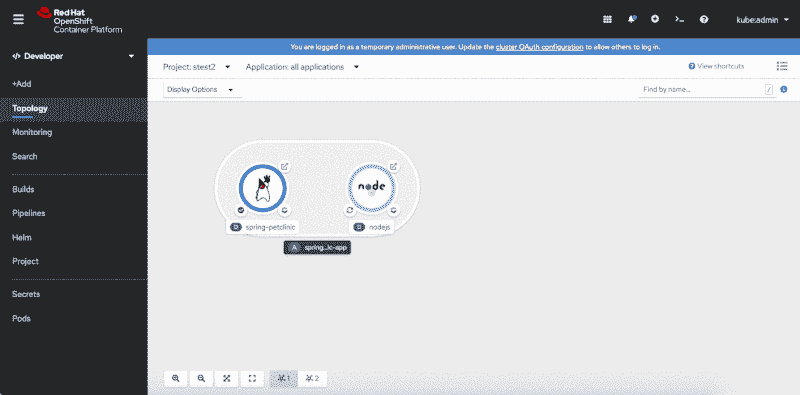
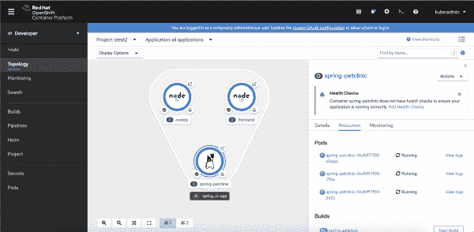
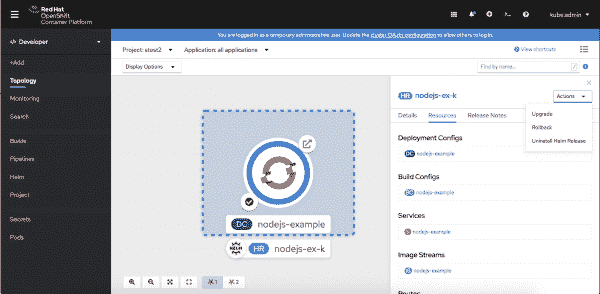
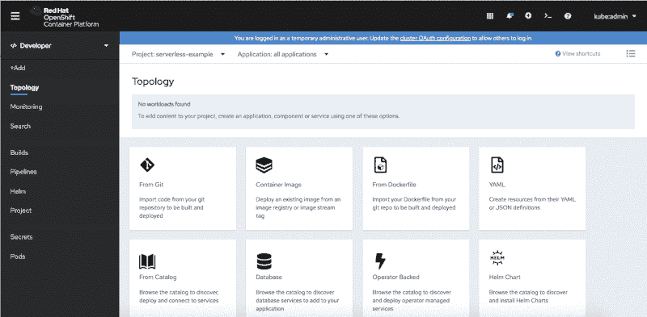
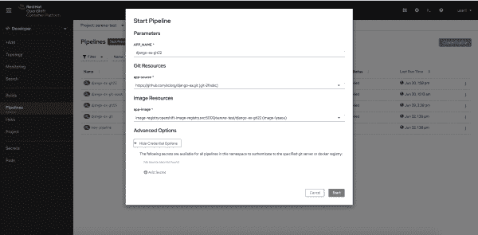
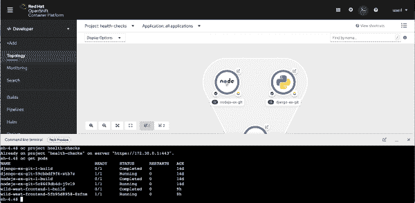

# OpenShift 4.5 控制台开发人员体验中的新功能

> 原文：<https://developers.redhat.com/blog/2020/07/16/whats-new-in-the-openshift-4-5-console-developer-experience>

Red Hat OpenShift 的每个新版本都包括可用性改进和特性，以帮助开发人员实现他们的目标。在 OpenShift 4.5 中，我们改进了导航，并添加了一种从开发人员角度定制导航和访问常用资源的机制。

我们还恢复了应用健康检查，增加了 Helm 的功能，并通过以下功能改进了 [Red Hat Operators](https://developers.redhat.com/topics/kubernetes/operators) :

*   支持在 web 控制台中创建事件源。
*   OpenShift 管道运算符中的新管道功能。
*   虚拟机与容器的统一体验。
*   在 web 终端中轻松访问命令行工具。

本文提供了 OpenShift 4.5 带来的好处的预览。

## 可定制的开发者导航

您是否发现自己经常搜索相同的资源类型或切换到管理员视角来访问特定的资源？OpenShift 4.5 有答案！作为几项导航改进之一，OpenShift 4.5 现在允许您使用搜索页面来查找常用资源，并将它们添加到您的导航中。

我们添加这个特性是因为我们从许多用户那里听说他们正在使用管理员视角来访问经常使用的资源。基于同样的反馈，我们还为默认导航预先添加了配置映射和秘密，如图 1 所示。

Figure 1: Customizable navigation with ConfigMaps and Secrets added by default.

**了解更多信息**:参见 OpenShift 4.5 开发者视角中的 *[改进的导航](https://developers.redhat.com/blog/2020/07/16/improved-navigation-in-the-openshift-4-5-developer-perspective)* 了解更多关于开发者视角中的导航改进。

## 运行状况检查回到了 web 控制台

OpenShift 3 web 控制台中提供了应用程序健康检查，我们收到了许多在应用程序开发端恢复该功能的请求。在 OpenShift 4.5 中，开发人员可以再次使用应用健康检查来主动检测、处理和缓解某些情况。

您可以从 OpenShift 4.5 web 控制台添加活动、就绪和启动探测器作为健康检查。如图 2 所示，您可以在创建过程中使用高级选项特性，也可以在创建应用程序后添加或编辑健康检查。

Figure 2: Use the Advanced Options feature to add application health checks when you create your app.

Figure 2: Use the Advanced Options feature to add application health checks when you create your app.

### 运行状况检查通知

如果您还没有配置健康检查，您将会在新拓扑视图的侧面板中看到一个通知，如图 3 所示。该通知支持可发现性，并提供了补救的快速链接。

Figure 3: Health check notifications in the new Topology view.

**了解更多信息**:参见 [*最佳实践:在 OpenShift 4.5 web 控制台*](https://developers.redhat.com/blog/2020/07/20/best-practices-using-health-checks-in-the-openshift-4-5-web-console/) 中使用健康检查，了解如何在您的应用程序中设置和使用健康检查。

## 舵图的新功能

在 OpenShift 4.5 中，我们用[头盔图](https://www.openshift.com/blog/getting-started-helm-openshift)升级了我们的游戏。开发人员现在可以使用 web 控制台即时访问已安装的 Helm chart 的发行说明，您也可以根据需要访问发行信息。

您可以使用 web 控制台拓扑视图中的侧面板来升级 Helm 版本。新的**升级**动作让你更新到一个新的版本或者直接编辑你当前版本的 YAML 文件。通过**回滚**操作，您可以打开 Helm 版本详细信息页面的**修订**选项卡，查看版本的修订。最后，新的 **Uninstall** 动作卸载并清理所有在 Helm chart 安装过程中添加的资源。

您可以从 web 控制台的拓扑视图中访问这些操作，使用拓扑侧面板中的 **Actions** 菜单，如图 4 所示。另一个选择是使用舵释放页面上的**动作**菜单。

Figure 4: Helm release actions in the side panel of the Topology view.

**了解更多**:查看 OpenShift 4.5 web 控制台 中的 [*高级头盔支持，查看 OpenShift 4.5 中头盔的更多增强功能。*](https://developers.redhat.com/blog/2020/07/20/advanced-helm-support-in-the-openshift-4-5-web-console/)

## 操作员改进

我们还增加了一些与运营商相关的改进。

### 在 web 控制台中创建事件源

Red Hat OpenShift 无服务器操作符已经增强了开发者在 OpenShift 中的体验。在 OpenShift 4.5 中，我们让开发人员通过 web 控制台创建事件源，从而使体验变得更好。

事件源为事件提供者提供了一种连接到应用程序并发送事件的机制。在 Knative 中，事件是基于[云事件规范](https://cloudevents.io/)的，它让用户以云不可知的方式描述事件数据。从本质上来说，一旦闲置了一段时间，Knative 服务就会缩减到零。有了事件源，提供者可以发送自动扩展 Knative 服务的事件，并使其在需要时可用。

如图 5 所示，开发人员现在可以使用基于表单的机制来创建事件源，然后使用 Knative 服务作为事件的“接收器”或目的地。

Figure 5: Create OpenShift Serverless event sources in the web console.

### 新的管道功能

当安装了 OpenShift Pipelines 运算符时，OpenShift 4.5 提供了新的管道功能。在管道的其他增强功能中，开发人员现在可以:

*   将触发器添加到它们的管道中(webhook 支持)。
*   启动管道时，将卷作为工作区装入。
*   根据需要，为 Git 存储库和映像注册中心提供凭证。

图 6 显示了为 Git 存储库和图像注册中心提供凭证的新选项。

Figure 6: The new pipeline credential options in OpenShift 4.5.

### 虚拟机和容器的统一体验

当即将推出的 [OpenShift 虚拟化操作员 2.4](https://developers.redhat.com/blog/2020/01/21/first-steps-with-the-data-virtualization-operator-for-red-hat-openshift/) 安装完成后，开发人员将能够通过引导式体验从 [Red Hat 虚拟化](https://www.redhat.com/en/technologies/virtualization/enterprise-virtualization)或 VMware 导入他们的虚拟机(VM)。

虚拟机将显示在拓扑视图中。正如开发人员通常所期望的那样，启动、停止、终止和访问等 VM 操作将被包括在内。

**注** : OpenShift 虚拟化操作员 2.4 将在 OpenShift 4.5 之后不久发布。在下一篇文章中寻找发布新闻和信息。

### 轻松访问网络终端

web 终端使您能够直接从 OpenShift web 控制台使用命令行界面(CLI)工具。诸如`oc`、`odo`和`kubectl`之类的 CLI 将在您需要时预装并完全认证。“终端”窗口可以调整大小、最小化和在新标签中打开。如图 7 所示，报头中的图标允许您创建 web 终端。然后，您可以直接从 web 控制台使用 CLI 工具。

Figure 7: Use command-line tools directly from the web terminal.

**注意**:该功能由操作员启用，将在 OpenShift 4.5 发布后不久作为更新推出。请继续关注包含更多信息的未来文章。

## 浏览新内容

[https://www.youtube.com/embed/S3sN8sPoO3g?autoplay=0&start=0&rel=0](https://www.youtube.com/embed/S3sN8sPoO3g?autoplay=0&start=0&rel=0)

## 请给我们您的反馈！

OpenShift 开发者体验的很大一部分是接收反馈并与我们的社区和客户合作。我们希望收到您的来信。我们希望您能在 [OpenShift 4.5 开发者体验反馈页面](https://forms.gle/zDd4tuWvjndCRVMD8)上分享您的想法。您还可以加入我们的 [OpenShift 开发者体验谷歌小组](https://groups.google.com/forum/#!forum/openshift-dev-users)，参与讨论并了解我们的办公时间会议，在那里您可以与我们合作，并提供关于您使用 OpenShift web 控制台的体验的反馈。

## 开始使用 OpenShift 4.5

你准备好开始使用新的 OpenShift 4.5 web 控制台了吗？[今天试试 open shift 4.5](http://www.openshift.com/try)。

*Last updated: June 17, 2022*