# Visual Studio 代码 XML 扩展中的新增功能

> 原文：<https://developers.redhat.com/blog/2019/07/24/whats-new-in-the-visual-studio-code-xml-extension>

Red Hat 的 Visual Studio Code XML Extension[的一个新的改进版本已经在版本 0.8.0 下发布。这个新版本带来了新的特性，为与 XSD 相关的特性(XML 文档的蓝图文件)提供了更多的支持，并带来了各种性能改进。](https://marketplace.visualstudio.com/items?itemName=redhat.vscode-xml)

## 新功能

#### 跳到相反的标签:

有时在大文档中，相反的开始/结束标签可能位于屏幕之外的其他地方，很难找到。现在，标签被视为超链接，通过 Ctrl+click，您现在可以从开始或结束标签跳到另一端。

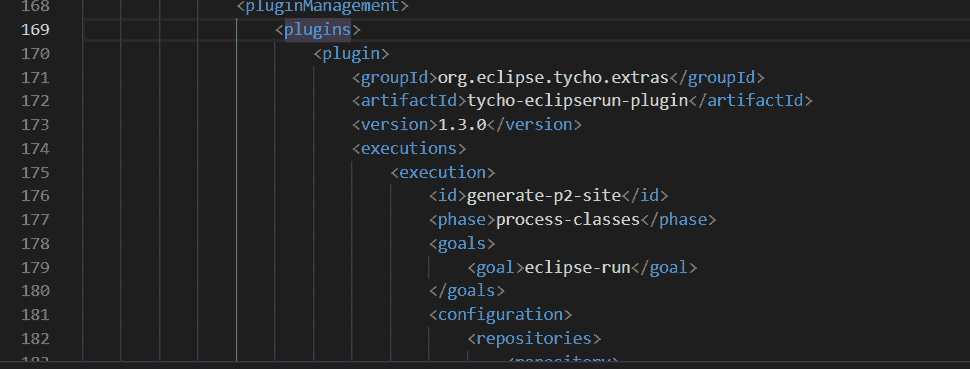

#### CDATA 和注释完成:

现在，您可以轻松地完成令人困惑的 CDATA 块以及注释。

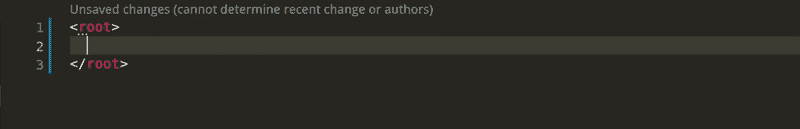

### XSD 相关更新

#### 基于 XSD 的精确完井:

在此版本之前，当在 XML 或 XSD 文档中创建元素时，基于 xsd 的自动完成建议并不总是正确的。根据许多约束，比如 minOccurs/maxOccurs，如果元素在一个序列中…提供的完成项可能无效。在版本 0.8.0 中，我们现在只提供有效的元素。

请参见下面，其中声明了一个包含 2 个元素的序列，但只提供了第一个元素来完成:

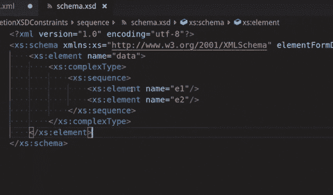

#### 外部 XSD 更改的 XML 文件验证:

最初是针对与 XSD 相关的 XML 验证，只有在 VS 代码应用程序内部打开/更改 XSD 时，才会触发验证。从这个版本开始，服务器将从外部跟踪 XSD 文件，检测所有更改，并执行适当的操作。

下图显示了在 vim 中外部更改了 XML 文件所链接的 XSD 后，VS 代码中出现的验证错误。

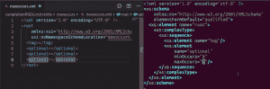

#### 突出显示 XSD 文件中的特定类型:

在 XSD 文件中，您可以引用一个类型，类型定义了 XML 文档必须遵循的特定 XML 结构。这种类型可以重复使用，并应用于文档中的多个区域，这可能会导致该类型到处出现。由于能够突出显示所有参考文献，用户可以滚动浏览文档并查看所有这些参考文献，而不必手动搜索每次使用。

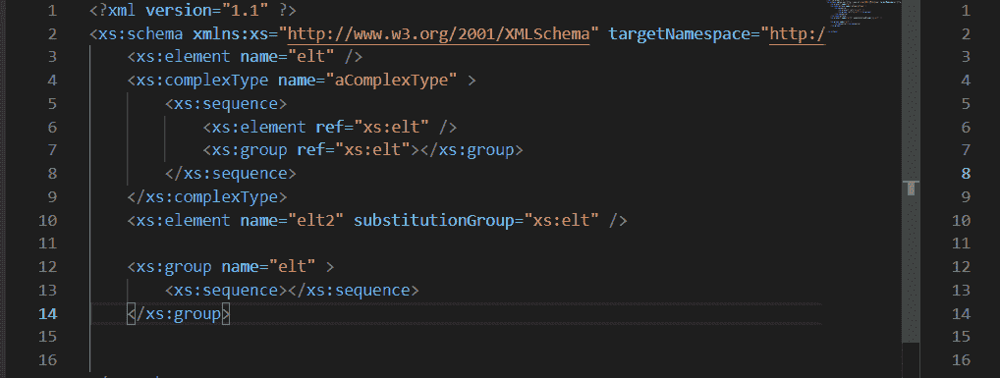

#### XSD 文件中的自动完成类型:

定义类型后，您可以开始将其应用于 XSD 文件中的元素。通常，您必须知道哪些类型已经被定义，然后键入它，确保写得正确。这个自动完成特性现在收集所有现有的类型，并通过完成来提供它们。

#### 跳到类型的定义:

如果您在 XSD 中使用一个使用类型的元素，您可能需要查看它的实际定义，以便能够看到它的结构。现在，您可以按住 Ctrl 键单击并直接转到定义，而不必在所有其他实现中手动搜索定义。

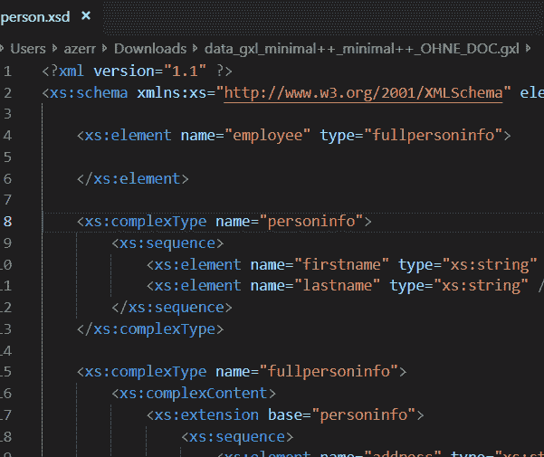

#### 搜索某个类型的引用:

通过选择 *Find All References* ，您现在可以找到模式类型的所有使用。在 VS 代码中这样做将打开一个中等大小的窗口，该窗口将对该类型的所有引用组合在一起，使得查找和通读该类型的每次使用变得容易。

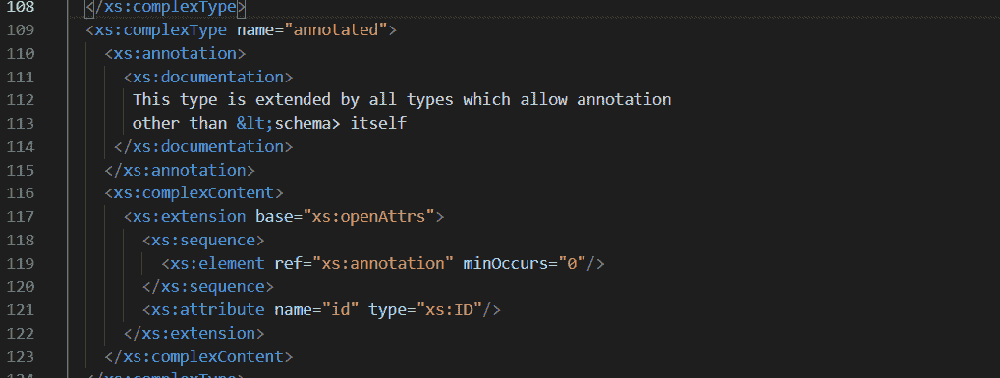

#### 查看作为 CodeLens 的类型的引用数:

与*查找所有引用*类似，我们也提供了一个同样可点击的 CodeLens。这将从*中调出同一个弹出窗口，查找所有引用*，并显示有多少引用。

#### 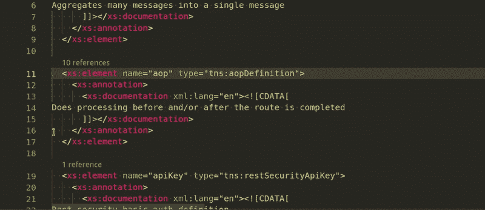

#### 从 XML 文档跳转到类型的定义:

与前面从 XSD 文件转到类型定义的能力类似，您也可以右键单击并选择*转到类型定义*来查找 XML 实现引用的类型。之前，您必须找出 XSD 中引用了哪个元素，然后找到该元素定义的类型定义。

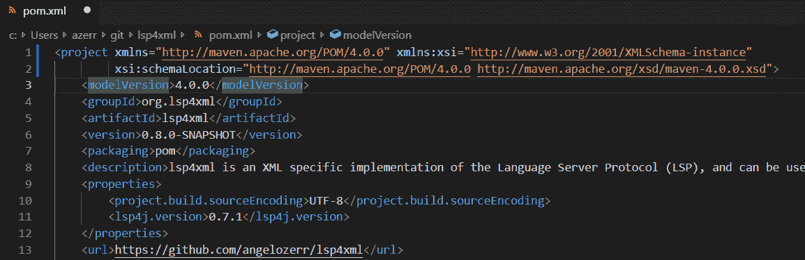

## 文档改进

#### 悬停和完井的文件以降价形式提供:

在 XSD 元素中，可以编写文档来提供关于该元素的一些信息。XML 允许使用 Markdown 或 HTML，当呈现 HTML 时，它不能很好地与 LSP 一起显示:

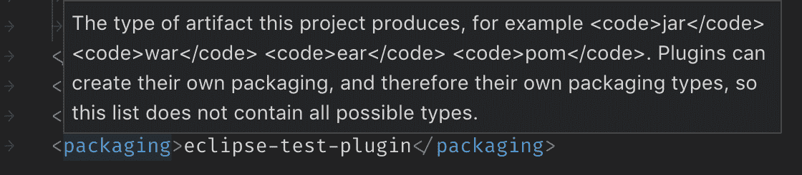

在此版本中，以下文档现在将正确显示在 Markdown 中，结果是:

此外，在描述的底部还提供了连接到 XSD 文件的超链接:

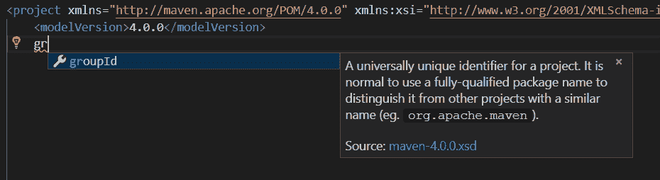

## 性能改进

这个版本关注于性能改进，我们正是通过减少内存使用和提高服务器速度来实现的。

#### 速度提升:

说得更专业一点，速度上的一个改进是用手工编写的 java 代码替换一些正则表达式(regex)。在这种情况下，正则表达式检查属性名，但是正如您可以想象的那样，在解析期间多个属性名正则表达式调用会变得有点费力。在这个改变之后，我们注意到大文件的速度提高了 2-3 倍！

#### 文档符号首选项:

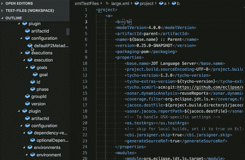

语言服务器协议提供了一种称为文档符号/大纲的功能。在上面 gif 的左侧是轮廓，它为 XML 文档中的每一个重要部分都提供了一个符号。在一个大文档中，你会有一个巨大的这些符号的列表，这些符号很可能是无用的，因为它们数量太多了。每当文档中发生变化时，这些符号都必须重新计算，可以想象，对于一个大文档来说，这是非常不利的。

考虑到这一点，我们提供了有选择地禁用与模式匹配的文件的大纲或者完全禁用它的能力。这样做大大减轻了 CPU 的负荷，并提高了处理大文件的性能。

#### 内存改进:

在语言服务器的引擎盖下，我们发现了一些导致大量内存消耗的低效问题；这是其中之一。

通常，当用户输入时，整个文档的新副本会被发送到服务器进行处理。随着文件变大，很容易发现这种方法的问题，因为用户最终会连续键入多个字符。增量同步是由 [LSP](https://microsoft.github.io/language-server-protocol/) 提供的一种方法，它只允许将改变的字符发送到服务器，以提供相同的结果，同时传输更少的数据。所以，这就是我们所做的。这样做可以节省大量内存，因为保存这些数据的缓冲区最多只需保存几个字符，而不是整个文档。