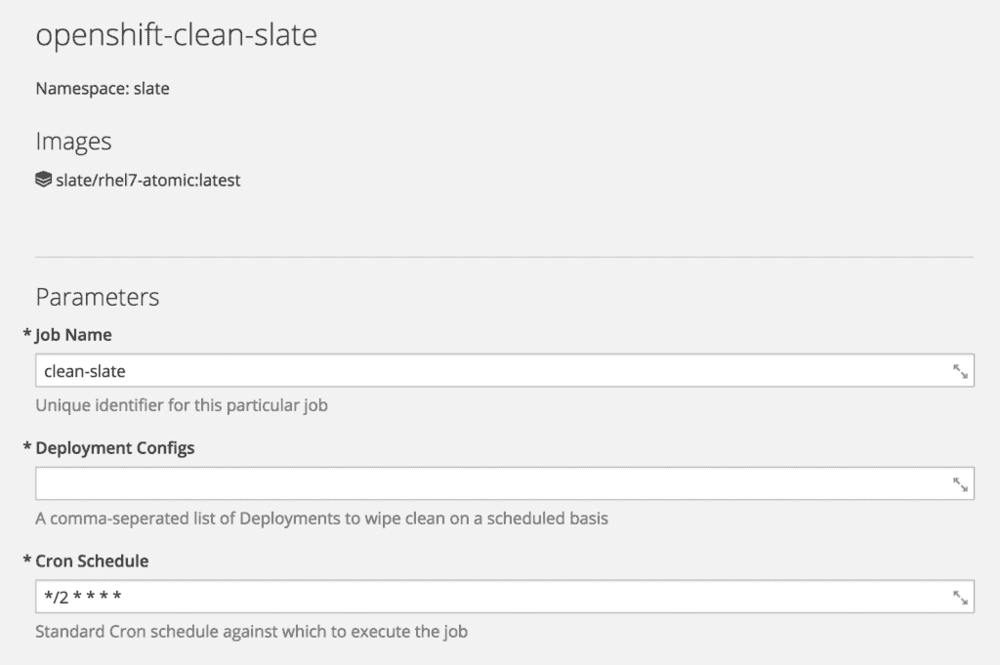

# 用 OpenShift 集装箱平台把石板擦干净

> 原文：<https://developers.redhat.com/blog/2017/11/16/wiping-slate-clean-openshift-container-platform>

对于传统的虚拟化基础架构或基础架构即服务，通常的做法是定期将实例刷新回已知的良好状态。这使人们确信应用程序工作负载具有正确的运行时配置，不会引入任何增量，并且可以依靠它们为业务提供价值。在这些情况下，您可能会使用诸如 [Ansible](https://www.redhat.com/en/technologies/management/ansible) 或 [Jenkins](https://jenkins.io/) 之类的工具，但是当我们将应用程序工作负载迁移到运行在 [OpenShift 容器平台](https://www.openshift.com/container-platform/)上的容器时，我们可以使用该平台提供的本地工具来实现相同的结果。

## 但我为什么要这么做？

应用程序状态仍然可以写入容器内的临时存储中——没有什么可以阻止这一点。这种反模式不仅会在初始容器状态之间引入增量，还会在 Pod 的多个副本之间引入增量。在容器中存储状态会产生雪花，这会抵消它们所提供的不变性和可伸缩性的好处。因此，拥有能够引起对不符合图像不变性原则的注意的工具是同样重要的，因为它首先要遵守它。

此外，拥有这样的机制还会在应用程序架构方面带来一些额外的好处。它可以用来强调是否:

*   Pod 中的容器能够优雅地处理强制关机/重启。
*   依赖于这个 Pod 的其他应用程序和服务能够优雅地处理它的缺失。
*   维护此 Pod 的足够多的副本，以在重新部署期间提供服务连续性。

## 这听起来都很合理。我该怎么做？

有益的是，OpenShift 有[作业](https://docs.openshift.com/container-platform/latest/dev_guide/jobs.html)的概念。与复制控制器不同，作业将运行包含任意数量副本的 Pod，直到完成。这个概念的一个扩展是 [CronJob](https://docs.openshift.com/container-platform/latest/dev_guide/cron_jobs.html) ，它与普通作业相同，但是增加了设置执行时间表的能力。这可以使用成熟的 [Cron](https://en.wikipedia.org/wiki/Cron) 符号来完成。对于执行短期工作负载或可能长期闲置的工作负载，它是一种非常强大的替代机制。

考虑到这些属性，CronJob 是执行清除历史记录的过程的完美机制。该流程需要按计划执行，最多持续几秒钟，并且有非常具体的任务要执行。但是实际上这看起来像什么呢？

在这个过程中，需要做几件事:

*   检查有效凭据
*   使用这些凭证通过 OpenShift API 进行身份验证
*   重新部署单元

所有这些任务都可以在 CronJob 中完成。这听起来并不难，是吗？

## 实施白板工作

### 证明

可以做出几个假设，使得实现该过程的任务相对简单。证书、环境元数据和正在执行的服务帐户的详细信息在运行时被注入到一个 Pod 中，允许进程进行自省并获得有关其环境的信息。该信息位于 location/run/secrets/kubernetes . io/service account。

```
[jboss@kitchensink-3-8fs58 serviceaccount]$
total 0
lrwxrwxrwx. 1 root root 13 Nov 10 10:56 ca.crt -> ..data/ca.crt
lrwxrwxrwx. 1 root root 16 Nov 10 10:56 namespace -> ..data/namespace
lrwxrwxrwx. 1 root root 21 Nov 10 10:56 service-ca.crt -> ..data/service-ca.crt
lrwxrwxrwx. 1 root root 12 Nov 10 10:56 token -> ..data/token

```

令牌和 ca.crt 文件在这里是最有用的。令牌包含用于运行 Pod 的服务帐户的身份验证令牌，证书可用于保护与 OpenShift API 的通信。这些信息可以在一个简单的脚本中使用，以便通过 OpenShift API 对流程进行身份验证:

```
#!/bin/bash

if [ -f /run/secrets/kubernetes.io/serviceaccount/token ]; then
	TOKEN=`cat /run/secrets/kubernetes.io/serviceaccount/token`
	PROJECT=`cat /run/secrets/kubernetes.io/serviceaccount/namespace`
	CA=/run/secrets/kubernetes.io/serviceaccount/ca.crt
else
	echo "No token found. Are you running on OpenShift?"
fi

# Make sure we're logged in
if [ -n "$TOKEN" ]; then
	echo "Authenticating with token"
	oc login $KUBERNETES_SERVICE_HOST:$KUBERNETES_SERVICE_PORT --token=$TOKEN --certificate-authority=$CA
fi

```

除了在运行时注入的文件之外，该脚本还利用了平台提供给 Pod 的环境变量作为标准——KUBERNETES _ SERVICE _ HOST 和 KUBERNETES_SERVICE_PORT。这些允许脚本识别 OpenShift API，并对其执行操作，而不必将 IP 地址或 DNS 名称硬编码到容器中，或者执行服务查找。

### Pod 重新部署

一旦通过身份验证，就可以使用 OpenShift API 执行操作。在我们作为 CronJob 的一部分执行的脚本中，可以迭代预先填充的 DeploymentConfigs 列表，并启动新的部署:

```
# Iterate through DCs, and execute a rollout on them
if [ -n "$DEPLOYMENT_CONFIGS" ]; then
	for dc in $(echo $DEPLOYMENT_CONFIGS | sed "s/,/ /g")
	do
		echo "--"
		echo "Wiping the slate of $dc"
		oc rollout latest dc/$dc -n $PROJECT
		echo "Done"
	done
else
	echo "No DeploymentConfigs specified. Skipping execution."
fi
```

DeploymentConfigs 的列表由 DEPLOYMENT_CONFIGS 环境变量提供，该变量又通过 OpenShift [ConfigMap 提供。](https://docs.openshift.com/container-platform/latest/dev_guide/configmaps.html)由于 DeploymentConfig 没有任何变化，这将启动现有容器的正常重新部署，配置与之前的 DeploymentConfig 相同。

### 作业容器

既然已经定义了作业的内容，就需要以一种允许 OpenShift 运行它的格式将其打包。这不可避免地意味着创建一个容器。为了保持这个容器尽可能轻，可以使用 [RHEL 原子基图像](https://access.redhat.com/documentation/en-us/red_hat_enterprise_linux_atomic_host/7/html/getting_started_with_containers/using_red_hat_base_container_images_standard_and_minimal#using_rhel_atomic_base_images_minimal)。构建这个容器最简单的方法是提供一个可以在 OpenShift 平台上构建和运行的 [Dockerfile](https://docs.docker.com/engine/reference/builder/) :

```
FROM registry.access.redhat.com/rhel7-atomic
...
ADD scripts/clean-slate.sh /opt/app/scripts/

RUN microdnf --enablerepo=rhel-7-server-rpms \
			install tar gzip --nodocs ;\
			microdnf clean all ;\
			curl --retry 5 -Lso /tmp/client-tools.tar.gz https://github.com/openshift/origin/releases/download/v3.6.0/openshift-origin-client-tools-v3.6.0-c4dd4cf-linux-64bit.tar.gz ;\
			tar zxf /tmp/client-tools.tar.gz --strip-components=1 -C /usr/local/bin
...		
CMD ["/opt/app/scripts/clean-slate.sh"]
```

**注意** -为简洁起见，省略了部分内容。

这个 does 文件做了很多事情:

1.  将上面创建的脚本添加到映像中。
2.  使用 Microdnf 来满足安装 [OpenShift 命令行工具](https://access.redhat.com/downloads/content/290)所需的依赖性。
3.  安装 OpenShift 命令行工具。
4.  将 CMD 点(将在容器中运行的流程)设置为我们添加到图像中的脚本。

### 作业定义

既然已经定义了容器，就需要告诉 OpenShift 如何使用它。这可以使用 CronJob 对象来完成:

```
- apiVersion: batch/v2alpha1
  kind: CronJob
  metadata:
    name: ${JOB_NAME}
    labels:
      job: ${JOB_NAME}
    annotations:
      alpha.image.policy.openshift.io/resolve-names: '*'
  spec:
    schedule: ${CRON_SCHEDULE}
    jobTemplate:             
      spec:
        template:
          metadata:
            labels:          
              parent: ${JOB_NAME}-parent
          spec:
            containers:
            - name: ${JOB_NAME}
              image: openshift-clean-slate:latest
              env:
              - name: DEPLOYMENT_CONFIGS
                valueFrom:
                  configMapKeyRef:
                    name: ${JOB_NAME}-config
                    key: deployment.configs              
            restartPolicy: OnFailure
```

在这个定义中，脚本中迭代的作业名称、Cron 调度和 DeploymentConfigs 被参数化为 OpenShift 模板的一部分，以使使用更容易。

### 服务帐户配置

用于执行作业的服务帐户必须拥有 OpenShift 项目的编辑权限。这允许它与 DeploymentConfigs 交互，并触发部署，就像它是平台的普通用户一样。这可以通过在需要执行作业的 OpenShift 项目环境中使用 OpenShift 命令行工具执行以下命令来实现:

```
oc policy add-role-to-user edit system:serviceaccount:$(oc project -q):default -n $(oc project -q)
```

### OpenShift 模板

为了将这些整合在一起，可以创建一个 [OpenShift 模板](https://raw.githubusercontent.com/benemon/openshift-clean-slate/blog/openshift/openshift-clean-slate.yaml)。这暴露了许多参数:

*   JOB_NAME -作业的唯一标识符
*   DEPLOYMENT_CONFIGS -作业的目标 DeploymentConfigs 的逗号分隔列表
*   CRON _ SCHEDULE——执行作业的标准 CRON 计划

实例化时，模板会显示一个如下所示的界面:



该模板将在 OpenShift 中创建许多对象:

*   用于创建作业容器的 BuildConfig。
*   CronJob 对象如上所示。
*   构建器图像的 image stream(RHEL 原子)。
*   作业容器的 ImageStream。
*   包含目标 DeploymentConfigs 的 ConfigMap，因此它可以在作业执行之间独立更改。这采用 DEPLOYMENT_CONFIGS 参数的值，并且可以独立于作业进行编辑。

**注意** -将作业容器的 ImageStream 的 lookupPolicy 设置为“true”非常重要，这样 CronJob 就可以引用 ImageStream。如果没有这一点(实际上，在 3.6 之前的 OpenShift 容器平台版本上)，将需要使用对映像的完全限定引用。这是作为模板的一部分完成的，但应注意以供将来参考。

### 最终结果

因此，模板已经创建，作业容器已经构建。当 Cron 计划触发并且作业正在运行时会发生什么？希望这将是一个非常快速的过程，并且需要检查作业日志来了解刚刚发生了什么。但是，应该会显示类似以下内容的输出:

```
Authenticating with token
Logged into "https://172.30.0.1:443" as "system:serviceaccount:slate:default" using the token provided.
You have one project on this server: "slate"
Using project "slate".
Welcome! See 'oc help' to get started.
--
Wiping the slate of kitchensink
deploymentconfig "kitchensink" rolled out
Done

```

## 等等。我可以用詹金斯来做这个

绝对的。但是这并不是人们传统上所说的简单问题的轻量级解决方案。在 Jenkins 中实现相同的结果涉及到管理在 OpenShift 中重新部署容器的过程的作业和插件的集成。相比之下，OpenShift 作业简单、可重复、易于扩展，并且使用本机功能，而不依赖于第三方 orchestrator。

## 资源

这个博客中的所有参考资料都可以在 GitHub 上找到。请注意，已经为该内容创建了一个特定的标记，因为不能保证主分支是稳定的。

[https://github.com/benemon/openshift-clean-slate/tree/blog](https://github.com/benemon/openshift-clean-slate/tree/blog)

* * *

**了解有关** [**Red Hat Openshift 容器平台**](https://developers.redhat.com/products/openshift/overview/) **的更多信息，该平台允许您供应、管理和扩展基于容器的应用程序。**

*Last updated: September 3, 2019*