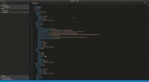

# YAML 语言服务器和 VS 代码的扩展

> 原文：<https://developers.redhat.com/blog/2017/10/18/yaml-language-server-extension-vs-code>

在 Openshift 和 Che land，我们定期处理部署应用程序的 YAML 文件。不幸的是，支持编辑这些文件的工具没有达到我们的期望。因为我们也是工具开发人员，所以我们决定考虑手头的事情，为 kubernetes 语法实现一个语言服务器。过去几个月来，我和乔希·平克尼一直在为此努力。随着我们实现的进展，我们意识到限制对 kubernetes 的扩展是浪费机会，我们重新组织了语言服务器以获得一般的 YAML 支持，但保留了内置的 kubernetes 语法支持。

今天，语言服务器可以作为 npm 上的[包获得。我们还发布了针对 VS 代码的](https://www.npmjs.com/package/yaml-language-server) [YAML 支持扩展](https://marketplace.visualstudio.com/items?itemName=redhat.vscode-yaml)，并将其集成到 Eclipse Che 中。它已经引起了不同社区的注意，例如被用于 Atom 的 [ide-yaml](https://atom.io/packages/ide-yaml) 包。

在这个初始版本中，支持的特性有:
**JSON 模式:** JSON 模式允许我们理解 yaml 文件的结构。我们提供了将模式映射到文件的设置。
**验证:**除了简单的语法验证，还提供了基于相关 JSON 模式的结构和值验证。
**IntelliSense:** 通过关联的 JSON 模式
**提供 IntelliSense 大纲:**允许快速导航到属性，对于大型文件尤其方便。
**悬停:**当悬停在属性和值上时，给出来自关联 JSON 模式的附加上下文。

*Last updated: September 3, 2019*