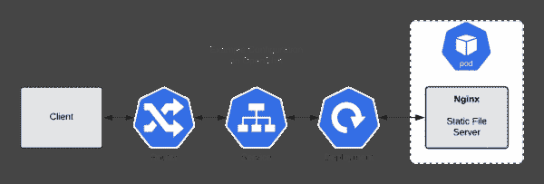
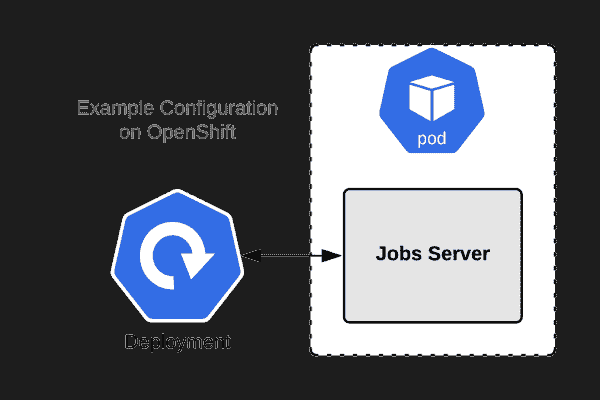
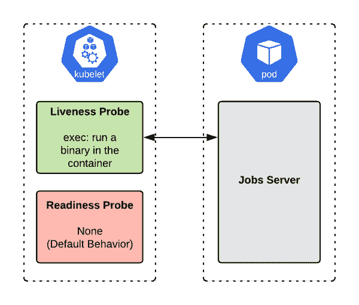
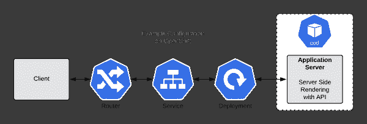
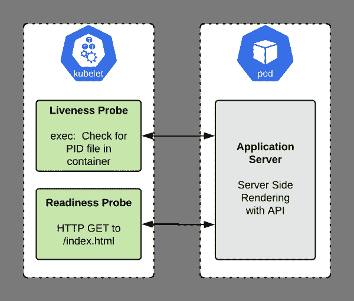
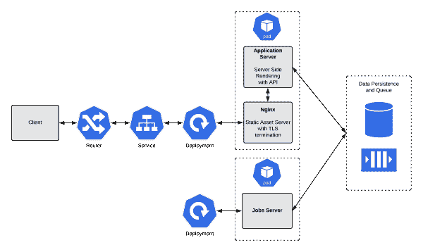
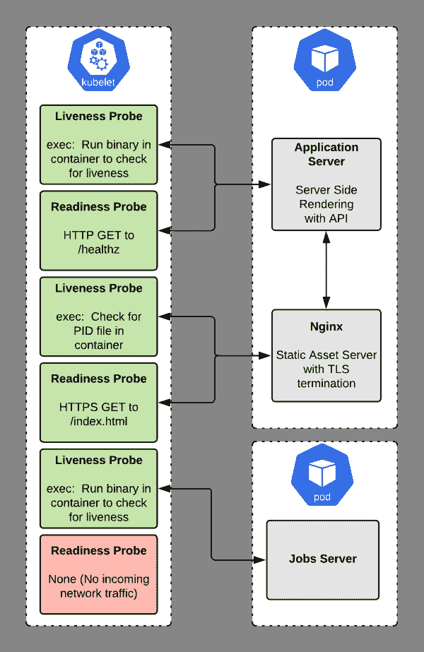

# 您(可能)需要活跃度和就绪性探测

> 原文：<https://developers.redhat.com/blog/2020/11/10/you-probably-need-liveness-and-readiness-probes>

作为一名顾问，我收到的最常见的问题之一是，“活性测试和就绪性测试之间的区别是什么？”下一个最常见的问题是，“我的应用程序需要哪一个？”

任何尝试过这些问题的人都知道，使用互联网搜索很难找到答案。在这篇文章中，我希望能帮助你自己回答这些问题。我将分享我对在部署到 [Red Hat OpenShift](https://developers.redhat.com/products/openshift/getting-started) 的应用程序中使用活跃度和就绪性探测器的最佳方式的看法。我不是提供一个硬性的规定，而是一个通用的框架，您可以用它来做出自己的架构决策。每个应用程序都是不同的，这些不同可能需要您调整在这里学到的“规则”。

为了使抽象更加具体，我提供了四个通用的应用程序示例。对于每一个，我们将探索是否以及如何配置活跃度和就绪性探测器。在我们深入例子之前，让我们更仔细地看看两种不同的探针类型。

**注意** : [Kubernetes](https://developers.redhat.com/topics/kubernetes) 最近采用了 OpenShift 4.5 集群中可用的新“启动”探测器[。启动探测器不能代替活性探测器和就绪探测器。一旦理解了活跃度和就绪性探测，您将很快理解启动探测。我不会在这里讨论启动探测器。](https://developers.redhat.com/blog/2020/07/20/best-practices-using-health-checks-in-the-openshift-4-5-web-console/)

## 活性和就绪性探测

*活性*和*就绪*是 OpenShift 中可用的两种主要探针类型。它们有相似的配置 API，但对平台的意义不同。

当活性探测失败时，它向 OpenShift 发出信号，表明被探测的容器已经死亡，应该重新启动。当准备就绪探测失败时，它向 OpenShift 指示被探测的容器没有准备好接收传入的网络流量。应用程序可能会在未来准备就绪，但现在不应接收流量。

如果活性探测成功，而就绪探测失败，则 OpenShift 知道容器没有准备好接收网络流量，但正在准备就绪。例如，这在需要时间来初始化或同步处理长时间运行的调用的应用程序中很常见。(同步处理长时间运行的调用是一种反模式，但不幸的是，我们在一些遗留应用程序中坚持使用它。)

接下来，我们将放大这些探针类型的具体用途。一旦我们独立地理解了探针类型，我将向您展示它们如何在 OpenShift 中协同工作的例子。

## 活性探测是为了什么？

活性探测器向 OpenShift 发送一个信号，表明容器是活的(通过)还是死的(失败)。如果容器是活动的，那么 OpenShift 不做任何事情，因为当前状态是好的。如果容器死了，那么 OpenShift 会尝试通过重启来修复应用程序。

名称*活性探针*表达了一个语义。实际上，探测器回答了对或错的问题:“这个容器是活的吗？”

## 如果我不指定活跃度探测器会怎样？

如果不指定活跃度探测器，那么 OpenShift 将根据容器的 [PID 1](https://felipec.wordpress.com/2013/11/04/init/) 进程的状态决定是否重启容器。PID 1 进程是容器内运行的所有其他进程的父进程。因为每个容器都有自己的[进程名称空间](https://en.wikipedia.org/wiki/Linux_namespaces#Process_ID_(pid))，所以容器中的第一个进程将承担[PID 1](https://blog.phusion.nl/2015/01/20/docker-and-the-pid-1-zombie-reaping-problem/)的特殊职责。

如果 PID 1 进程退出并且没有定义活性探测器，OpenShift 假定(通常是安全的)容器已经死亡。重启流程是唯一与应用程序无关的、普遍有效的纠正措施。只要 PID 1 是活动的，不管是否有任何子进程正在运行，OpenShift 都将保持容器运行。

如果您的应用程序是单个进程，并且该进程是 PID 1，那么这个默认行为可能正是您想要的——这意味着您不需要活跃度探测器。如果你使用的是`init`工具，如 [tini](https://github.com/krallin/tini) 或[哑初始化](https://engineeringblog.yelp.com/2016/01/dumb-init-an-init-for-docker.html)，那么它可能*而不是*是你想要的。是否定义自己的活跃度探测器而不是使用默认行为的决定是特定于每个应用程序的

## 准备就绪探测的目的是什么？

OpenShift [服务](https://docs.openshift.com/container-platform/3.11/architecture/core_concepts/pods_and_services.html#services)使用就绪探测来了解被探测的容器是否准备好开始接收网络流量。如果您的容器进入一种状态，在这种状态下，它仍然处于活动状态，但是无法处理传入的网络流量(这是启动过程中常见的情况)，您希望就绪探测失败。这样，OpenShift 就不会将网络流量发送到没有准备好的容器。如果 OpenShift 确实过早地向容器发送网络流量，它可能会导致负载平衡器(或路由器)向客户端返回 502 错误并终止请求；否则，客户端将会收到“连接被拒绝”的错误消息。

像活性探测器一样，*就绪探测器*的名称传达了一个语义。实际上，这个探测回答了是非问题:“这个容器准备好接收网络流量了吗？”

## 如果我不指定就绪探测器会怎样？

如果你没有指定一个就绪探测器，OpenShift 将会认为容器已经准备好接收流量，只要 [PID 1](https://felipec.wordpress.com/2013/11/04/init/) 已经启动。这是*永远也不*想要的。

假设准备就绪而不检查它将在新容器启动时导致错误(例如来自 OpenShift 路由器的 502 ),例如在缩放事件或部署时。如果没有准备就绪探测器，每次部署时都会出现大量错误，因为旧容器会终止，而新容器会启动。如果您正在使用 [autoscaling](https://docs.openshift.com/container-platform/4.4/nodes/pods/nodes-pods-autoscaling.html) ，那么根据您设置的度量阈值，新的实例可以随时启动和停止，尤其是在负载波动的时候。随着应用程序规模的扩大或缩小，您将会遇到突发的错误，因为负载平衡器分发中包含了未准备好接收网络流量的容器。

您可以通过指定就绪探测器来轻松修复这些问题。该探测器为 OpenShift 提供了一种询问容器是否准备好接收流量的方法。

接下来，让我们看一些具体的例子，它们将帮助我们理解这两种类型的探针之间的区别以及正确使用它们的重要性。

**注意**:不同类型的探头具有相同的 API，这一事实经常引起混淆。但是两种或更多种探针类型的存在是很好的设计:它使得 OpenShift 对于各种应用程序类型都很灵活。活性和就绪性探针的可用性对于 OpenShift 作为一个[容器即服务](https://www.redhat.com/en/topics/cloud-computing/what-is-caas)的声誉至关重要，它可以容纳各种各样的应用程序。

## 示例 1:静态文件服务器(Nginx)

[](/sites/default/files/blog/2020/07/Probes-Example1-Problem-e1597967760719.png)

Figure 1: Example of an Nginx static file server implementation.

图 1 所示的示例应用程序是一个简单的静态文件服务器，它使用 [Nginx](https://docs.nginx.com/nginx/admin-guide/web-server/serving-static-content/) 来提供文件服务。启动时间很短，检查服务器是否正在处理流量也很简单:您可以请求一个已知的页面，并验证是否返回了一个 [200 HTTP 响应](https://developer.mozilla.org/en-US/docs/Web/HTTP/Status)。

### 我们需要一个活性探针吗？

应用程序会快速启动，如果遇到阻止它提供页面的错误，它将退出。因此，在这种情况下，我们不需要活性探测器。退出的 Nginx 进程意味着应用程序已经死亡，需要重新启动。(注意，像 SELinux 问题或错误配置的文件系统权限不会导致 Nginx 退出，但是重启也不能解决这些问题。)

### 我们需要准备就绪探测器吗？

Nginx 正在处理传入的网络流量，所以我们*确实*需要一个就绪探测器。无论何时处理网络流量，您都需要一个准备就绪探测器来避免遇到容器启动错误，比如部署和自动伸缩。Nginx 启动很快，所以你可能会很幸运，但是我们仍然希望在容器准备好之前避免转发流量，这是最佳实践。

### 用就绪探测器更新服务器

我们需要对每个例子进行具体的修改，但是首先，这里是`Deployment`的顶部。我们将在进行过程中更改这个文件，但顶部将保持不变。对于未来的例子，我们只需要修改模板规范。

```
apiVersion: apps/v1
kind: Deployment
metadata:
  labels:
    app: application-nginx
  name: application-nginx
spec:
  replicas: 1
  selector:
    matchLabels:
      app: application-nginx
  template:
    metadata:
      labels:
        app: application-nginx
    spec:
      # Will appear below as it changes

```

以下是第一个示例的探头配置:

```
    spec:
      containers:
      - image: quay.io/<username>/nginx:latest
        name: application-nginx
        imagePullPolicy: Always
        ports:
        - containerPort: 8443
          protocol: TCP
        readinessProbe:
          httpGet:
            scheme: HTTPS
            path: /index.html
            port: 8443
          initialDelaySeconds: 10
          periodSeconds: 5

```

[")](/sites/default/files/blog/2020/07/Probes-Example1-Solution2.png)

Figure 2: The Nginx static file server implementation with the readiness probe configured.

## 示例 2:一个作业服务器(没有 REST API)

许多应用程序都有一个 HTTP web 组件，以及一个异步“作业”组件。作业不需要就绪检查，因为它们不处理传入的网络流量。然而，它们确实需要活性检查。如果运行作业的进程终止，那么容器就没有价值，作业将在队列中堆积。通常，重新启动容器是正确的做法，因此这里最好使用活性探测器。

图 3 中的示例应用程序是一个简单的作业服务器，它从一个[队列](https://www.redhat.com/en/technologies/jboss-middleware/amq)中弹出并运行任务。它不直接处理传入的网络流量。

[](/sites/default/files/blog/2020/07/Probes-Example2-Problem.png)

Figure 3: The jobs server implementation without a liveness probe.

我已经提到过，这种类型的应用程序受益于活跃度探测，但是无论如何，完成查询过程并没有什么坏处。

### 我们需要一个活性探针吗？

当我们的工作正常运行时，它将是一个活的过程。如果作业容器停止工作，很可能是崩溃、未处理的异常或类似情况。在这种情况下，我们如何设置探测器取决于我们的作业进程是否作为 PID 1 运行。

如果我们的作业进程是 PID 1，当它遇到异常时就会退出。如果没有指定活性探测器，OpenShift 会将 PID 1 的退出视为死亡，并将重新启动容器。对于琐碎的作业服务器，重启可能不是我们想要的。

然而，在现实生活中，事情有时会更复杂。例如，如果我们的作业进程遇到了一个[死锁](https://en.wikipedia.org/wiki/Deadlock)，它可能看起来仍然是活动的，因为该进程正在运行，但它显然处于失败状态，应该重新启动。

为了帮助检测死锁，每当我们的应用程序处理一个作业时，它都会在`/tmp/jobs.update`将当前系统时间以毫秒为单位写入一个文件。然后将使用 shell 命令(通过 [exec](https://access.redhat.com/documentation/en-us/openshift_container_platform/3.11/html/developer_guide/dev-guide-application-health) 活跃度探测器)检查该时间，以确保当前作业的运行时间没有超过给定的超时值。然后，应用程序可以通过执行`/usr/bin/my-application-jobs --alive`来检查自身的活性。

我们可以如下设置一个活性探测器(同样，我省略了前面展示的`Deployment` YAML 文件的第一部分):

```
    spec:
      containers:
      - image: quay.io/<username>/my-application-jobs:latest
        name: my-application-jobs
        imagePullPolicy: Always
        livenessProbe:
          exec:
            command:
            - /bin/sh
            - -c
            - "/usr/bin/my-application-jobs --alive"
          initialDelaySeconds: 10
          periodSeconds: 5

```

### 我们需要准备就绪探测器吗？

在这种情况下，不需要准备就绪探测。记住，准备就绪探测器向 OpenShift 发送一个信号，表明容器已经准备好处理网络流量，因此可以添加到负载均衡器中。因为此应用程序不处理传入的网络流量，所以不需要检查它是否准备就绪。我们可以不做准备探测了。图 4 显示了配置了活跃度探测器的作业服务器实现。

[](/sites/default/files/blog/2020/07/Probes-Example2-Solution.png)

Figure 4: The jobs server implementation with a liveness probe.

## 示例 3:带有 API 的服务器端呈现的应用程序

[](/sites/default/files/blog/2020/07/Probes-Example3-Problem.png)

Figure 5: The SSR application without any probes configured.

这个例子是一个标准的服务器端呈现(SSR)应用程序:它按需在服务器上呈现 HTML 页面，并将它们发送到客户机。我们可以使用 [Spring Boot](https://developers.redhat.com/topics/spring-boot) 、PHP、Ruby on Rails、Django、 [Node.js](https://developers.redhat.com/blog/category/node-js/) 或任何类似的框架来构建这样的应用程序。

### 我们需要一个活性探针吗？

如果应用程序在几秒钟或更短的时间内启动，那么可能就不需要活动探测。如果花费的时间超过几秒钟，我们应该放入一个活跃度探测器，以确保容器初始化时没有错误，而不是崩溃。

在这种情况下，我们可以使用一个 [exec](https://access.redhat.com/documentation/en-us/openshift_container_platform/3.11/html/developer_guide/dev-guide-application-health) 类型的活跃度探测器，它运行一个 shell 命令来确保事情仍然在运行。该命令因应用而异。例如，如果应用程序编写了一个 PID 文件，我们可以检查它是否仍然存在:

```
        livenessProbe:
          exec:
            command:
            - /bin/sh
            - -c
            - "[ -f /run/my-application-web.pid ] && ps -A | grep my-application-web"
          initialDelaySeconds: 10
          periodSeconds: 5

```

### 我们需要准备就绪探测器吗？

因为这个应用程序处理传入的网络请求，所以我们*肯定*想要一个就绪探测。如果没有准备就绪探测，OpenShift 将在启动后立即向我们的容器发送网络流量，无论应用程序是否准备就绪。如果容器开始丢弃请求但没有崩溃，它将无限期地继续接收流量，这当然不是我们想要的。

如果容器不再返回健康的响应，我们希望 OpenShift 从负载均衡器中删除容器。我们可以使用这样的准备就绪探测器向 OpenShift 发出信号，表明容器已经准备好接收网络流量:

```
        readinessProbe:
          httpGet:
            scheme: HTTPS
            path: /healthz
            port: 8443
          initialDelaySeconds: 10
          periodSeconds: 5

```

为了便于参考，下面是这个示例应用程序的完整 YAML:

```
apiVersion: apps/v1
kind: Deployment
metadata:
  labels:
    app: backend-service
  name: backend-service
spec:
  replicas: 1
  selector:
    matchLabels:
      app: backend-service
  template:
    metadata:
      labels:
        app: backend-service
    spec:
      containers:
      - image: quay.io/<username>/backend-service:latest
        name: backend-service
        imagePullPolicy: Always
        ports:
        - containerPort: 8443
          protocol: TCP
        readinessProbe:
          httpGet:
            scheme: HTTPS
            path: /healthz
            port: 8443
          initialDelaySeconds: 10
          periodSeconds: 5

```

图 6 显示了配置了活跃度和就绪性探针的 SSR 应用程序的示意图。

[](/sites/default/files/blog/2020/07/Probes-Example3-Solution.png)

Figure 6: The SSR application with both liveness and readiness probes configured.

## 示例 4:将所有内容放在一起

在一个完整、复杂和现实的应用程序中，您可能拥有前面三个示例的所有元素。单独考虑它们有助于考虑探针，但是看到它们一起工作来服务于具有数百万个请求的大型应用程序也是有帮助的。最后一个例子合并了其他三个例子。

[](/sites/default/files/blog/2020/07/Probes-Example4-Problem.png)

Figure 7: A realistic OpenShift application example for exploring the use of probes.

这个示例应用程序由三个容器部分组成:

*   **应用服务器**:这个服务器提供了一个 REST API，对一些页面进行服务器端渲染。这种设置非常普遍，因为最初作为简单的服务器端呈现器的应用程序后来得到了增强，可以提供 REST API 端点。
*   **一个 Nginx 静态文件服务器**:这个容器有两个工作:它为应用程序渲染静态资产(比如 JavaScript 和 CSS 资产)。它还通过充当某些路径的反向代理，为应用服务器提供 TLS(传输层安全性)终止。这也是一种普遍的设置。
*   作业服务器:这个容器本身不处理输入的网络流量，而是处理作业。应用服务器将每个作业推送到一个队列中，在那里作业服务器拾取并执行它。作业服务器释放了应用服务器，使其专注于处理网络请求，而不是运行长线程。

示例应用程序还包括几个数据持久性服务:

*   关系数据库:关系数据库是我们应用程序的状态源。几乎每个应用程序都需要某种类型的数据库，关系数据库是大多数人的选择。
*   **队列**:队列为应用服务器提供了一种先进先出(FIFO)的方式来将任务传递给作业服务器。应用服务器会一直推送，作业服务器会弹出。

我们的集装箱被分成两部分:

*   第一个 pod 由我们的应用服务器和 Nginx TLS 终结器或静态文件服务器组成。这通过允许应用服务器直接通过 HTTP 进行通信，简化了应用服务器的管理。通过共享一个 pod，这些容器可以以最小的延迟安全而直接地进行通信。他们还可以访问共享的卷空间。这些容器需要缩放在一起，并作为一个单元来处理，因此 pod 是完美的组织单元。
*   第二个 pod 由作业服务器组成。这个服务器需要独立于其他容器进行扩展，所以它必须在自己的 pod 中。因为所有状态都保存在数据库和队列中，所以作业服务器可以轻松地访问它需要的资源。

如果您遵循前面的示例，这里的解决方案应该不会令人惊讶。为了进行集成，我们将应用服务器切换为使用 HTTP 和端口 8080，而不是 HTTPS 和 8443 进行准备就绪探测。我们还向应用服务器添加了一个活跃度探测器，以便在应用服务器出错时不退出时保护我们。这样，我们的容器将在 Kubelet“死亡”后重新启动:

```
# Pod One - Application Server and Nginx
apiVersion: apps/v1
kind: Deployment
metadata:
  labels:
    app: my-application-web
  name: my-application-web
spec:
  replicas: 1
  selector:
    matchLabels:
      app: my-application-web
  template:
    metadata:
      labels:
        app: my-application-web
    spec:
      containers:
      - image: quay.io/<username>/my-application-nginx:latest
        name: my-application-nginx
        imagePullPolicy: Always
        ports:
        - containerPort: 8443
          protocol: TCP
        livenessProbe:
          exec:
            command:
            - /bin/sh
            - -c
            - "[ -f /run/nginx.pid ] && ps -A | grep nginx"
          initialDelaySeconds: 10
          periodSeconds: 5
        readinessProbe:
          httpGet:
            scheme: HTTPS
            path: /index.html
            port: 8443
          initialDelaySeconds: 10
          periodSeconds: 5
      - image: quay.io/<username>/my-application-app-server:latest
        name: my-application-app-server
        imagePullPolicy: Always
        ports:
        - containerPort: 8080
          protocol: TCP
        livenessProbe:
          exec:
            command:
            - /bin/sh
            - -c
            - "/usr/bin/my-application-web --alive"
          initialDelaySeconds: 10
          periodSeconds: 5
        readinessProbe:
          httpGet:
            scheme: HTTP
            path: /healthz
            port: 8080
          initialDelaySeconds: 10
          periodSeconds: 5

# Pod Two - Jobs Server
apiVersion: apps/v1
kind: Deployment
metadata:
  labels:
    app: my-application-jobs
  name: my-application-jobs
spec:
  replicas: 1
  selector:
    matchLabels:
      app: my-application-jobs
  template:
    metadata:
      labels:
        app: my-application-jobs
    spec:
      containers:
      - image: quay.io/<username>/my-application-jobs:latest
        name: my-application-jobs
        imagePullPolicy: Always
        livenessProbe:
          exec:
            command:
            - /bin/sh
            - -c
            - "/usr/bin/my-application-jobs --alive"
          initialDelaySeconds: 10
          periodSeconds: 5

```

图 8 显示了配置了两个探针的完整示例应用程序。

[](/sites/default/files/blog/2020/07/Probes-Example4-Solution.png)

Figure 8: The complete example applications with both probes configured.

## 相同的活跃度和就绪性探测呢？

虽然这种模式被过度使用，但在我看来，在某些情况下它是有意义的。如果应用程序开始经历失败的 HTTP 调用，并且在没有重启的情况下可能永远不会回到就绪状态，那么您可能希望 OpenShift 重启 pod。如果您的应用程序能够自行恢复，那就更好了，但这在现实世界中有时是不切实际的。

如果您有一个很好的 HTTP 端点，那么您可以设置一个活跃度探测和一个就绪性探测来探测同一个端点。使用同一个端点可以确保如果 pod 在该端点上未能返回成功，它将重新启动。

## 最后的想法

活性和准备就绪探测器向 OpenShift 发送不同的信号。每一个都有特定的含义，它们是不可互换的。一个失败的活性探测告诉 OpenShift 重新启动容器。一个失败的就绪探测告诉 OpenShift 暂停向该容器发送流量。

对于探针，没有一个放之四海而皆准的方法，因为“正确”的选择会因应用程序的编写方式而异。一个可以自我修复的应用程序将需要一个不同的探针设置，而不是一个简单的崩溃和死亡。

在为应用程序决定正确的探测器时，我会结合应用程序的行为考虑探测器的语义。知道失败的活性探测将重新启动容器，而失败的就绪性探测将从负载平衡器中删除它。确定应用程序需要哪些探测器通常并不复杂。

我们已经考虑了现实的例子，但是你可能会在真实的系统中看到更多的复杂性。例如，在[面向服务的架构(SOA)](https://en.wikipedia.org/wiki/Service-oriented_architecture) 中，一个服务可能依赖另一个服务来处理请求。如果下游服务没有准备好，那么上游的准备就绪探测应该是健康的还是不健康的？答案取决于应用程序。您需要进行成本/收益分析，以确定增加的复杂性是否值得。

虽然探针在概念上非常简单，但在实践中可能会很复杂。缩小范围的最好方法就是迭代！进行性能测试和混乱测试，以确定您的配置如何运行并随着您的发展而改进。我们很少第一次就做对。

*Last updated: April 1, 2022*